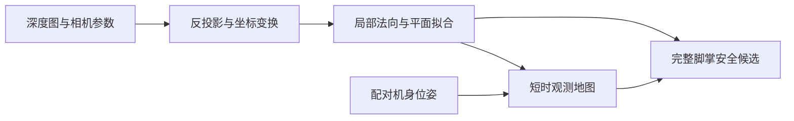

# ELF3：深度平面与可踩踏区域

本分支恢复基于深度图、相机内外参和机器人位姿的显式感知：提取台阶水平面，计算完整脚掌的安全候选，并通过短时地图保留已观测区域。基础版本为 Hiking 实现前的 `e0ec789`；2026-10-08 已在独立目录完成回放验收。




## 直接复现

仓库附带 [5 帧原始样例](examples/perception/stairs_15cm/README.md)，含 RGB、深度、相机参数、配对机身／足部位姿及原始采集时间戳。本机执行：

```bash
cd /home/hamlet/TienKung-Lab-perception
/home/hamlet/miniconda3/envs/isaac_sim_env/bin/python -m legged_lab.scripts.replay_stair_surfaces \
  --input_dirs examples/perception/stairs_15cm \
  --output_dir logs/perception_restore/demo \
  --surface_memory --save_images --normal_window_size 7 --normal_radius 4
```

图像输出到 `logs/perception_restore/demo/stairs_15cm/`，统计为 `logs/perception_restore/demo/report.json`。离线入口使用 NumPy、SciPy、OpenCV、PyTorch，在 CPU 上执行，无需启动 Isaac Sim 或加载策略权重。其他机器从仓库根目录使用自己的 Python 环境运行相同模块。

## 验收与范围

- 5 帧随仓库样例：98 个候选，净距与高度违规均为 0；下楼四个连续观察后，下一阶 29 个候选，左右各 8 个。
- 本地完整 52 帧回放：13,043 个候选，两项违规均为 0。
- 核心感知测试：44 项、4 项子测试通过。

绿色表示观测覆盖和整脚几何条件成立；实际可达性、接触承重和动态行走需要另行验收。真值只用于输出后的独立审计，不参与平面识别或候选选择。上述数据来自仿真 RGB-D，物理 D435i 接入仍待验证。

| 文档 | 内容 |
|---|---|
| [感知说明](docs/perception.md) | 参数、代码入口、完整数据回放与 RTX 采集 |
| [历史改进报告](docs/stair_surface_refinement_report.md) | 恢复的 2026-10-03 报告与原始图片 |
| [样例清单](examples/perception/stairs_15cm/manifest.json) | 原始来源、时间戳与逐文件 SHA256 |
