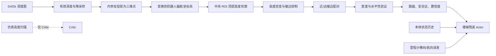
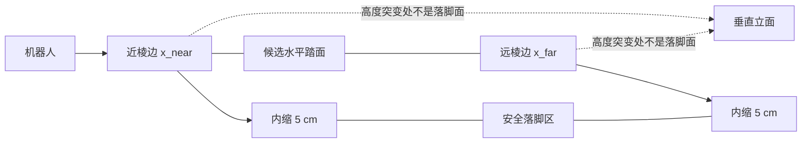
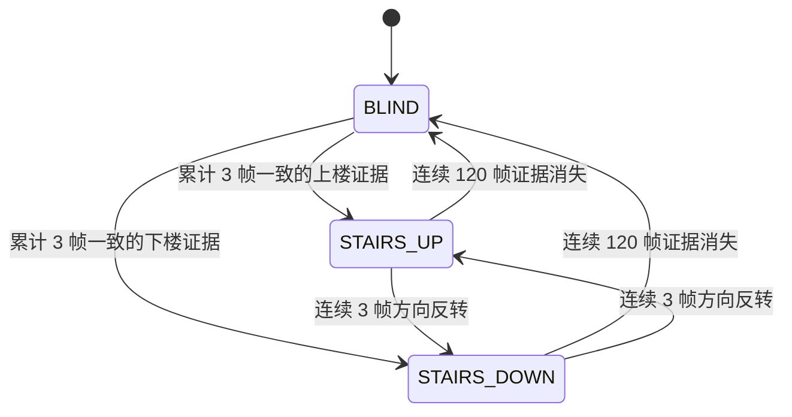
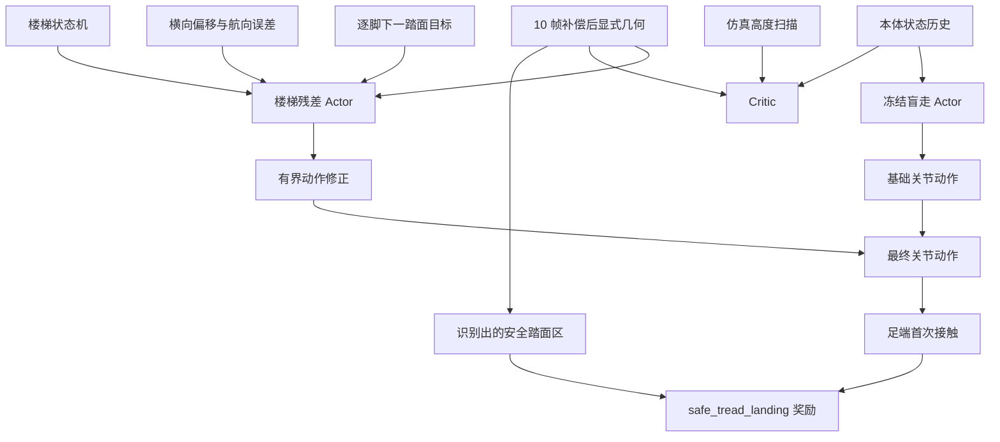

# ELF3 显式地形几何感知与行走策略融合

> 状态：显式几何、状态机门控、冻结盲走底座、楼梯残差策略、连续赛道课程和调试可视化均已接入；高难度楼梯仍在训练验证，不能视为已稳定通过。

2026-10-02 更新：当前上下楼踏面统一为 32 cm，高度课程保留 11–16 cm。旧截图及实验表中的 20–30 cm 尺寸属于历史设置。新二维诊断已实现，采用 24 cm 完整脚掌、上楼脚跟/下楼脚尖 2 cm 关键净距；实测仍有候选净距错误，尚未用于策略控制，见 [第一批报告及新图](stair_surface_validation_report.md)。逐级并步控制见 [stair_step_control_plan.md](stair_step_control_plan.md)，尚未实现或训练。下面的一维特征、5 cm 内缩、20.6 cm 奖励范围及旧图均属于旧控制路径，未被新诊断替换。

## 1. 设计目标

本方案不把深度图直接输入行走网络。D435i 深度图先经过确定性的几何模块，输出楼梯近/远棱边、水平踏面、安全落脚区和地形粗糙度，再与本体感知一起输入策略。

这样可以明确排除垂直立面，并让每个视觉判断都能在图上检查。Actor 只使用本体状态和显式几何特征；仿真高度扫描只供训练期 Critic 使用，部署时不依赖仿真真值。



## 2. 相机配置

| 项目 | 配置 |
| --- | --- |
| 真实/原生调试分辨率 | 1280 x 720 |
| 训练渲染与几何处理分辨率 | 160 x 90 |
| 水平视场角 | 87 度 |
| 垂直视场角 | 58 度 |
| 深度有效范围 | 0.3–5.0 m |
| 深度更新频率 | 25 Hz |
| 策略控制频率 | 50 Hz |
| 几何历史 | 10 帧，按机器人位姿补偿 |

真实 1280 x 720 深度图会降采样到 160 x 90 后处理。仿真和实机保持相同视场及标定内参，因此降采样只改变点数，不改变可见空间范围。

对于深度像素 `(u, v, d)`，反投影为 ROS optical 相机坐标：

```text
x_c = (u - c_x) d / f_x
y_c = (v - c_y) d / f_y
z_c = d
```

再利用相机世界位姿与机器人位姿，将点转换到只保留机器人偏航角的局部坐标系：

```text
p_body = R_yaw^T (R_wc p_camera + t_wc - t_robot)
```

去除机器人自身俯仰和侧倾后，水平踏面不会因为机身姿态被误判为斜面。当前检测区域为前向 `0.15–2.00 m`、横向 `-0.35–0.35 m`、相对高度 `-1.50–0.35 m`。

## 3. 棱边和水平踏面

ROI 按 2.5 cm 前向间隔分箱，每箱取顶部高度，形成一维轮廓 `h(x)`。短缺口先由相邻有效值插补，再进行中值平滑。相邻箱高度差

```text
delta_h(x) = h(x + delta_x) - h(x)
```

若落在 8–21 cm 的容差范围内，就成为候选楼梯棱边；非极大值抑制合并邻近重复响应。棱边高度变化的符号用于区分上楼与下楼。



近、远棱边之间必须同时满足：

- 前后距离为 16–36 cm，覆盖 20/25/30 cm 踏面并保留估计容差；
- 区域高度标准差不超过 3.5 cm；
- 两个棱边的方向、踏面高度和连续性一致。

只有通过这些条件的区间才被标记为踏面，所以垂直面只用于定位边界，不会成为可落脚平面。

单个踏面置信度为：

```text
C = 0.4 C_riser + 0.3 C_width + 0.3 C_flatness
```

三项分别衡量台阶高度、踏面宽度和区域水平性。模块还输出整帧楼梯置信度、粗糙度和纵向坡度。鹅卵石通常有较多不规则局部起伏，但无法形成规则、同向且间距合适的棱边对，因此应表现为较高粗糙度、较低楼梯置信度和无有效踏面。

## 4. 输出给策略的特征

最多输出前方 4 个踏面，每个踏面 6 维：

| 特征 | 含义 |
| --- | --- |
| `near_x` | 靠近机器人的棱边距离 |
| `far_x` | 远离机器人的棱边距离 |
| `height` | 踏面相对高度 |
| `depth` | 踏面前后宽度 |
| `confidence` | 踏面置信度 |
| `valid` | 有效踏面标志 |

另有 `[楼梯方向, 整帧置信度, 粗糙度, 纵向坡度]` 4 个全局量，所以每帧是 `4 x 6 + 4 = 28` 维；10 帧历史共 280 维。历史棱边先利用各帧机器人位置和偏航角变换到当前坐标系，防止机器人快速下楼时旧棱边在观测中剧烈跳变。

为避免上下楼时斜穿台阶，残差分支还接收 4 个可部署的赛道对齐量：归一化横向偏移、航向误差、横向速度和偏航角速度。每只脚另外收到 4 维下一踏面目标：相对前向距离、踏面与足底的高度差、踏面宽度、置信度。目标从 40 帧位姿补偿的踏面记忆中挑选，必须位于摆动脚前方，且与另一只支撑脚同高或只差下一阶；上楼时不会把低处旧台阶误认为目标，下楼同理。融合 Actor 输入为原 960 维本体历史、280 维几何历史、4 维对齐量、8 维逐脚目标和 1 维楼梯模式，共 1253 维。

逐脚目标锁定是可选实验：离地后把当前踏面的世界位置保持到再次触地，可抑制高速运动引起的目标跳阶；但未重训策略时，锁定目标和直接叠加 IK 都可能降低通过率，所以二者默认关闭。当前正式训练使用 40 帧踏面记忆，不强制锁定。足端接触必须按接触传感器自身的 body ID 读取：本仿真中左脚在机器人关节树中是 ID 28，在接触传感器中是 ID 23；混用 ID 会让左脚目标与控制判断错误。

策略不是直接改写原盲走网络。原 960 维盲走 Actor 从 `model_43600.pt` 加载并冻结；新网络只学习有界动作残差。当模式为 `BLIND=0` 时残差严格乘零，动作与盲走底座完全相同；只有连续多帧确认楼梯后，`STAIRS_UP=+1` 或 `STAIRS_DOWN=-1` 才允许几何残差参与。



一个有效踏面已经由两条同向棱边围成，因此进入判据要求至少一个有效踏面，而不是两个踏面。相邻漏检帧会让证据计数逐步衰减而非立即清零，用来吸收行走时躯干俯仰造成的短暂丢边；单帧伪检仍无法打开门控。退出滞回最长约 2.4 秒，因而楼梯末端的一小段平地仍可能保持楼梯模式；这是后续连续赛道验证必须检查的边界。

## 5. 深度图与置信图

本节原为旧一维高度轮廓、棱边与启发式置信图，不是二维完整脚掌规划。2026-10-05 按用户要求，二维规划启用前的旧截图已移入系统回收站，并移除本节图片链接；清理范围见 [图片清理记录](image_cleanup_20261005.md)。

保留的二维观测地图、RGB、深度与左右脚掌候选图见 [二维感知修复报告](stair_surface_refinement_report.md)。当前实际 MuJoCo 动作截图见 [动作教师记录](mujoco_action_teacher.md)。旧一维图不再作为当前落脚规划效果展示。

## 6. 策略与奖励



`safe_tread_landing` 使用独立的 40 帧运动补偿踏面记忆；Actor 的原始几何输入仍为 10 帧，检查点输入尺寸不变。将足底前后范围（踝点后方 7.4 cm 至前方 13.2 cm）投影到机器人偏航坐标系，检查与两侧内缩 5 cm 的踏面至少重叠 8 cm、足底中心位于踏面中间一半，且足底与踏面世界高度相差不超过 6 cm。只有接触力垂直分量超过 5 N、占合力至少 65%、水平脚速低于 0.25 m/s 并连续满足 3 个控制帧，才计为一次确认落脚并发放触地奖励。单帧擦边仍只计候选接触。诊断分别报告候选接触、安全首次接触、确认落脚次数。

`foothold_target_alignment_exp` 只在有支撑脚的摆动阶段评价脚与下一踏面中心的前后误差。楼梯专项课程不再为单纯的前进距离和接触高度发放跨阶奖励；只有同一控制帧里，深度踏面、连续三帧稳定承重和对应台阶高度都得到确认，才给该新高度一次进度奖励。若跳过一级，后来安全踩上新高度仍可得一次奖励，但不会补发跳过的级数。终点通关另行奖励。姿态航向反馈只在楼梯状态开启，通过盲走 Actor 已支持的偏航速度命令修正横向漂移；非楼梯段仍走盲走动作。可选的世界锁定摆动脚轨迹和雅可比修正默认关闭；未经这套控制共同训练时，即使只允许高置信当前可见踏面介入，也会降低安全落脚数。

原有速度跟踪、姿态、能耗、动作平滑和足端离地高度等奖励继续保留。楼梯任务的目标足端离地高度设为 18 cm，可覆盖课程中最高 16 cm 台阶并保留余量。赛道中心线惩罚和航向奖励在楼梯训练中提高权重，与对齐观测共同抑制斜走。

不对楼梯速度设置固定上限。旧等待机制在每一次脚接触后停步，确实损害行走；新机制只在下楼时，足底支撑高度确实下降至少 5.5 cm 后短暂停顿 0.08–0.24 s，等待新深度帧稳定。在最终目标选择器和严格落脚判据的同种子 8 环境对照中，开启后为 5 次通关/8 次失败、81 次确认落脚；关闭时为 6 次通关/9 次失败、60 次确认落脚。它改善了落脚确认信号，但通关收益未证实。上楼和非楼梯段不会触发这一停顿。

## 7. 连续赛道与宽度课程

完整赛道约 40 m，顺序为：

```text
起点平地 -> 8 级上楼梯 -> 8 级下楼梯 -> 上坡 -> 坡顶平台 -> 下坡 -> 鹅卵石 -> 终点平地
```

楼梯专项训练使用 32 个并行机器人，每个机器人在每个等级有自己的物理车道，共 96 条车道，避免其他机器人进入深度视野。单机器人播放只生成一条车道。踏面宽度固定为 32 cm，三个等级仅改变高度：

| 等级 | 踏面宽度 | 台阶高度 |
| --- | --- | --- |
| 0 | 32 cm | 11.0–12.6 cm |
| 1 | 32 cm | 12.7–14.3 cm |
| 2 | 32 cm | 14.4–16.0 cm |

楼梯专项任务完成当前楼梯段后晋级，过早失败则回退一级；完整赛道任务需要到达终点才晋级。地形等级只切换并行车道，不会把机器人出生点移动到赛道中段。坡面不再使用自动补零高度边框；11、15、16 cm 三种课程难度的全部相邻地形端点均通过高度连续性检查。完整赛道 episode 需要至少 160 s 才适合按 0.3 m/s 测试，楼梯专项为 30 s。连续赛道尚未证明能够稳定通关。

## 8. 当前限制

1. 当前中央走廊输出前向安全区间，还不是完整二维落脚多边形；横向对齐由短时里程计和 IMU 参考提供。
2. 实机需要标定 D435i 外参，并同步相机与机器人状态时间戳。
3. 强反光、黑色材料和遮挡会产生无效深度，需要用真实数据调整插值长度和置信阈值。
4. 修复左脚接触索引后，下楼权重仍对逐脚目标几乎不敏感：8 级 15 cm 下楼测试中目标有效率约 11.9%，遮掉目标后的平均动作差异仅 `0.000016`。预告下一踏面可将目标有效率提高到约 31.4%，但旧权重未经重训时通关率下降，因此该开关只用于新训练实验。当前通关不等于主动精准落脚已学成。
5. 相机实测光轴约向下 66–69 度；再调低会缩短下一踏面的可见距离。先保持现有外参并验证近端覆盖，不能把下楼滑落简单归因于相机不够朝下。
6. 一维高度标准差未直接验证平面法向或左右支撑覆盖；当前双棱边配对还可能漏掉末端平台。这些缺口需要二维观测与水平面验证，不能以高启发式置信评分替代。

## 9. 代码入口

```text
legged_lab/perception/stair_geometry.py
legged_lab/sensors/camera/camera_cfgs/d435i_depth_config.py
legged_lab/envs/elf3/elf3_env.py
legged_lab/mdp/rewards_elf3.py
legged_lab/envs/elf3/walk_terrain_teacher_cfg.py
legged_lab/terrains/terrain_generator_cfg.py
```

单环境可视化命令：

```bash
python legged_lab/scripts/play.py \
  --task=walk_elf3_geometry_debug \
  --headless --num_envs=1 \
  --terrain_mode=configured --terrain_type=stairs_up_32 \
  --terrain_difficulty=0.8 --command_x=0.3 --max_steps=120 \
  --skip_export --save_geometry_dir=logs/geometry_debug \
  --save_depth_every=10 --save_depth_max=8 \
  --load_run=2026-09-19_12-54-59_elf3_atec_blind_final_v18_1024env_3k \
  --checkpoint=model_43600.pt
```

保存同步 RGB 与深度图时增加：

```bash
--save_rgb_dir=logs/rgb --save_depth_dir=logs/depth
```

训练后的融合 checkpoint 可用 `--disable_geometry_action` 再播放一次。正常播放与关闭几何动作的成功率、最大前进距离有明显差异，同时 `geometry_residual_abs` 非零，才说明几何分支在策略层真正发挥了作用。

### 历史验证记录（32 cm 更新前）

先检查整条赛道的网格端点高度；此命令不会加载策略：

```bash
/home/hamlet/miniconda3/envs/isaac_sim_env/bin/python legged_lab/scripts/play.py \
  --task=walk_elf3_geometry_course --headless --verify_course_geometry
```

当前推荐的下楼权重为 `logs/walk/2026-09-30_13-59-17_elf3_correct_contacts_down15cm_v29/model_3197.pt`。单车道实时查看机器人、RGB、深度和落脚确认：

```bash
/home/hamlet/miniconda3/envs/isaac_sim_env/bin/python legged_lab/scripts/play.py \
  --task=walk_elf3_geometry_stairs_down_bootstrap \
  --terrain_mode=configured --terrain_difficulty=0.8 \
  --num_envs=1 --command_x=0.3 --max_steps=0 \
  --show_rgb --show_depth --show_geometry --trace_footsteps --skip_export \
  --load_run=2026-09-30_13-59-17_elf3_correct_contacts_down15cm_v29 \
  --checkpoint=model_3197.pt
```

不要加 `--headless`；按 `q` 退出。当前版本按 8 级楼梯、15 cm 高、约 22 cm 宽和固定种子 42、8 环境、900 步评测：

| 权重和设置 | 通关 / 失败 | 安全首次接触 / 近踏面候选 | 连续确认落脚 |
| --- | ---: | ---: | ---: |
| `v29`，确认下降后停顿 | 5 / 8 | 62 / 235 | 81 |
| `v29`，`--disable_stair_settle` | 6 / 9 | 42 / 183 | 60 |
| `v30`，预告目标续训 1000 轮 | 5 / 13 | 44 / 216 | 72 |

`v30` 的目标有效率从约 11.9% 提高到 32.4%，但遮掉逐脚目标后的平均动作变化仍仅 `0.000066`，整体通关没有超过 `v29`，暂不推荐替换。通关率是完成回合数除以完成与失败回合数，不是单次机器人在整条赛道上的成功率。完整赛道、16 cm 窄踏面与上楼/下楼共用一个策略尚未验证成功。

连续赛道入口实测使用 `v29`、难度 `0.8`、单环境 1200 步：机器人进入上楼模式，但在上楼段中途复位，最大前进 `4.84 m`，尚未到坡道。完整赛道目前不能使用下楼专项权重宣称通关。

### 落脚闭环实验（2026-10-01）

以下统一为 8 环境、900 控制步、15 cm 高/约 22 cm 宽的 8 级下楼梯。安全首次触地必须满足踏面内缩、足底重叠和向上接触力；验证跨阶还要求连续稳定承重及匹配的新台阶高度。数值是事件计数，不是整段成功率。

| 权重 / 设置 | 种子 | 通关 / 失败 | 安全首次触地 | 验证跨阶 | 偏出车道 / 接触失败 |
| --- | ---: | ---: | ---: | ---: | ---: |
| `v29` 基线 | 42 | 5 / 8 | 62 | 48 | 2 / 6 |
| `v32` 目标输入 1.0 | 42 | 3 / 14 | 63 | 60 | 未分类 |
| `v32` 目标输入 0.5 | 42 | 5 / 10 | 69 | 51 | 5 / 5 |
| `v33` 目标输入 0.5 | 42 | 7 / 9 | 50 | 41 | 2 / 7 |
| `v33` 目标输入 0.75 | 42 | 7 / 10 | 60 | 47 | 5 / 5 |
| `v29` 基线 | 43 | 8 / 6 | 37 | 23 | 3 / 3 |
| `v32` 目标输入 1.0 | 43 | 5 / 12 | 53 | 52 | 5 / 7 |
| `v33` 目标输入 0.75 | 43 | 5 / 14 | 61 | 49 | 2 / 12 |
| `v34` 髋部净空奖励 | 42 | 4 / 9 | 60 | 47 | 4 / 5 |
| `v34` 髋部净空奖励 | 43 | 5 / 12 | 36 | 32 | 2 / 10 |

`v32` 的目标输入消融为 6/9 通关、48 次安全首次触地和 37 次验证跨阶（种子 42）；正常输入则为 3/14、63、60。这证明目标特征影响了落脚，但还不能同时保持稳定性。`v33` 增加通关/失败奖励比例并降低跨阶奖励后，种子 42 的通关改善，但种子 43 显著退化。世界锁定摆动脚 IK 在 `v29` 上即使采用高置信当前帧门控，也只有 38 次安全首次触地和 30 次验证跨阶，仍不推荐。

上表“通关”沿用旧定义：底座到达下楼段末端且没有触发非足部接触/偏出车道；它**不等于**连续踩准全部踏面。现在回放另输出 `stair_goal_stable_support`（终点附近至少 3 帧有足底向上承重、足底处于终点平台高度、支撑脚水平速度低且髋部有净空）和 `stair_goal_verified_level`（抵达时已确认的最高台阶等级）。自 2026-10-01 起，新安全成功判定还要求 8 个实际台阶高度都曾被足底居中、向上承重且连续稳定 3 帧；旧表中的距离到达数不能与新成功数混用。

接触失败按连杆分类后，`v32` 种子 42 的 12 次接触失败中 9 次为髋部撞击，`v29` 的 6 次中有 4 次髋部撞击。髋部相对支撑脚低于 0.45 m 的帧比例从 `v29` 的 2.0% 增至 `v32` 的 3.4%。实验性的髋部净空奖励 `v34` 在种子 42 减少了接触失败，但在种子 43 反而从 `v32` 的 7 次升至 10 次，落脚指标明显下降，因此该奖励默认权重为 0。全身质量加权质心的捕获点估计也已加入评测诊断；它是近似动力学指标，尚未证明能预测这些失败，未用于奖励。

另加入楼梯模式下的连续非足部碰撞力风险项，使用终止接触连杆的历史峰值，在 20 N 以上开始产生惩罚、320 N 时封顶；其权重默认也是 0，可用 `--stair_collision_force_penalty=...` 开启。该项尚未完成训练对照，不能认定会改善髋部碰撞。

本机另一个 ATEC 仓库提供参数化步态参考加 RL 稳定器，但没有深度踏面到足端目标的闭环实现，不能直接替换当前系统。现阶段仍推荐 `v29` 作为可视化基线；`v32`、`v33`、`v34` 都只是对照模型，不是新默认。

下一步重点应是把目标踏面与身体稳定一起学习：在单脚支撑期间预告并锁定世界目标，明确约束质心相对于支撑脚的位置、横向漂移和触地后的速度，再联合训练足端轨迹与有界残差策略。现有实验仅验证了深度目标对落脚有因果作用，尚未达到上下楼梯、坡道和鹅卵石整赛道可靠通关。

### 楼梯边缘安全审计（2026-10-02）

固定种子 42、8 环境、900 控制步、难度 0.8（约 15 cm 高、22 cm 宽）的下楼专项对照。`距离到达` 仅表示底座到了末端；`严格成功` 要求每一级都被实际居中承重并在末端稳定站住。`物理覆盖` 是所有回合中首次满足稳定承重的台阶事件数，不是完成回合数。

| 权重 / 控制 | 距离到达 | 严格成功 | 物理覆盖 | 不安全首次触地 | 接触失败 |
| --- | ---: | ---: | ---: | ---: | ---: |
| `v29`，未校正深度边界 | 5 | 0 | 41 | 71 | 6 |
| `v29`，下楼边界校正 -6.5 cm | 6 | 0 | 28 | 55 | 8 |
| `v38`，校正深度、固定难度续训至 `model_3600.pt` | 2 | 0 | 20 | 44 | 14 |
| `v29`，校正深度 + 强脚端轨迹 | 3 | 0 | 34 | 43 | 8 |
| `v29`，校正深度 + 踏面预锁定 + 强脚端轨迹 | 2 | 0 | 23 | 37 | 7 |
| `v39`，校正深度 + 有符号越界目标 + 2 倍腿部残差，`model_3700.pt` | 4 | 0 | 30 | 73 | 8 |
| `v39`，同配置，`model_3900.pt` | 3 | 0 | 25 | 64 | 12 |
| `v39`，同配置，最终 `model_4096.pt` | 5 | 0 | 18 | 39 | 5 |

高置信踏面相对仿真网格的中心偏差在机器人静止时仍为向前 6.1 cm，排除了运动帧延迟作为主因；行走时约 6.3 cm。对模拟 D435i 160 x 90 深度提取加入可配置的下楼边界校正后，行走时平均绝对误差降为约 2.2 cm。此数值是仿真标定，真实 D435i 须另行标定，不能直接假定通用。

`v38` 用 `--geometry_terrain_difficulty=0.8` 固定在窄踏面训练，避免旧课程因严格成功数为零而一直停在宽踏面。该次进程达到约 469/600 轮后触及 15 分钟运行上限；最后可用权重 `model_3600.pt`。回放中末端到达的两次仅各覆盖 2/8 级，按级统计出现明显隔级踩踏。增大脚端 IK 权限或提前锁定目标只能减少部分不安全接触，没有形成可靠逐级落脚，因此预锁定实验没有保留为默认功能。

`v39` 又修正了一个目标生命周期问题：摆动脚超过踏面中心后约 12 cm 内仍保留有符号的脚到目标误差，防止脚越过中心时感知目标突然消失。该版本从 `v29` 固定难度续训 900 轮，增加两倍腿部残差权限，训练中严格完成奖励始终为零；最终模型虽然把危险首次触地降到 39 次，但物理覆盖也降到 18 次。目标动作敏感度为 `0.000110`，高于旧权重，但不足以可靠决定落脚。普通宽度课程另允许在终点稳定站住且 8 级中至少 6 级实际居中承重时晋级，正式成功标准仍是 8/8。`v39` 不应替换 `v29` 作为行走基线。

当前不能宣称边缘风险已解决，更不能把这些权重部署到真实机器人。下一阶段需要重新训练能控制步幅和支撑转换的楼梯专项策略，并以 `stair_goal_physical_by_level`、`unsafe_tread_first_contacts`、非足部碰撞和 8/8 严格成功率共同验收；仅优化总 reward 或到达末端次数不够。
