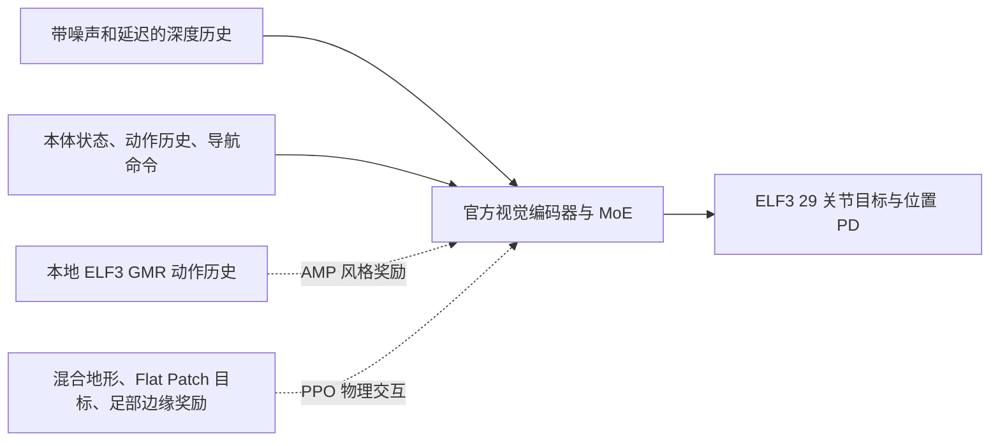

# ELF3：直接迁移 Hiking in the Wild

更新：2026-10-07。主线改为官方 InstinctLab parkour + instinct_rl，适配 ELF3 身体与本地 GMR；视觉和控制从同一次训练开始学习。迁移运行结果见[数据与训练](data_and_training.md)。

## 目标与结构

连续、安全地通过平地、上下楼、坡道和不平地形，尽量保持自然步态。不要求逐级双脚并步停稳。先训练步行策略。

保留官方 8 帧视觉/本体历史、10 帧 AMP、目标生成、地形课程与深度噪声机制。普通楼梯课程范围 5–18 cm，踏面 32 cm，包含 11–16 cm 目标；所有官方地形类别一起训练，自动调难度。低台阶只是混合课程的一部分。

## 必要适配

- ELF3 29 个关节按名称映射，采用 ELF3 的质量、惯量、限位、力矩和隐式 PD，位置目标延迟 0–10 ms；不能加载 G1 策略权重当作 ELF3 策略。
- 相机使用现有 ELF3 外参，保留地形及机器人自身遮挡；官方 GPU 光线投射直接生成训练深度。
- 按 ELF3 24×8.4 cm 脚尺寸调整足部体积点，边缘圆柱半径 2 cm。
- 349 条训练 GMR 从已审核的 50 Hz 缓存直接转成官方动作格式；验证人物不进入训练。官方 loader 按名称重排，保留根姿态与速度信息。静默换片时清理对应 AMP 参考历史，避免窗口混入上一片段。
- 入口默认 256 个并行环境；本机已实测约 2,400–2,500 transitions/s，不以官方 4096 环境预算推算收敛日期。

依赖提交锁定在 `legged_lab/hiking/upstream.lock.json`，下载位于忽略的 `third_party/`。额外 Python 依赖隔离加载，保留现有 Isaac/PyTorch 环境。两个官方源码均保留各自 LICENSE；当前锁定提交为 CC BY-NC 4.0。

## 既有工作的位置

平面识别、安全区域、视觉规划继续用于导航、安全检查和对照；不作为启动官方视觉训练的前置关卡。MuJoCo 单级教师保留作物理对照，不接管主线动作。

之前 `elf3_continuous_flat/up/down` 为真值几何诊断基线，不再按“平地收敛→真值楼梯收敛→最后接视觉”的顺序推进。其短训练未证明连续上下楼成功。旧实验清理及历史结论见[清理记录](cleanup_20261007.md)。

## 验收

先核验真实深度进入策略、视觉编码器/策略/AMP 均更新、全部地形配置有效和断点可恢复，再持续训练。能力验收使用保留地形与种子，从场景起点完整通过，不使用教师接管或中途初始化。

分别报告通过率、跌倒/碰撞、脚缘承重与滑移、冲击、关节/力矩余量及正侧面视频。奖励上涨、入口跑通和到达终点均不能单独代替安全与自然性验收。

来源：[论文](https://arxiv.org/html/2601.07718v1)、[官方项目](https://project-instinct.github.io/hiking-in-the-wild/)、[InstinctLab](https://github.com/project-instinct/InstinctLab)、[instinct_rl](https://github.com/project-instinct/instinct_rl)。
