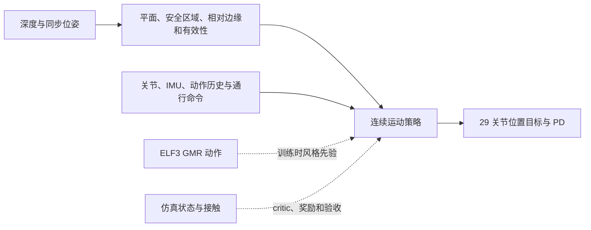

# 连续、自然的 ELF3 楼梯运动主线

更新：2026-10-07。当前为已确定的实施方案，连续任务、运动先验适配和新策略训练尚待实现。

## 目标与保留成果

目标是连续、安全地上下楼，通常交替迈步，困难处允许并步或短暂停顿；避免拖脚、滑下楼、长时间跳跃和异常扭动。不强制逐级双脚并步停稳，也不以到达终点代替安全和自然性检查。

保留深度平面与整脚安全区域识别、ELF3 模型与基础训练工具、单级 MuJoCo 教师及轨迹。教师用于物理可行性、数据采集和对照，不定义最终连续步态。Event 教师仍使用单级支撑门控及末端停稳，这是教师自身的验收协议。

此前停顿式学生路线未完成从头独立上下楼：最后一轮 1,024,000 控制步中全起点成功 0/6372，末段接管成功主要来自已接近完成的教师状态。相关试验已清理，结果不能重新标记为新任务成功。正确几何下仍失败，支持优先解决运动学习和任务定义；尚不能据此判定唯一失败原因。

## 系统结构

视觉给出可信区域与通行条件，策略学习身体移动、抬脚和支撑转换。初期使用真值生成与感知相同格式的局部几何输入；控制基线成立后换入实际识别结果，测量遮挡、延迟、缺失和位姿误差的影响。这是本项目的工程顺序；原 Hiking 采用单阶段深度端到端训练。

部署 actor 只使用可取得的输入。训练可用接触力和地形真值计算奖励、critic 与审计；教师的接触真值依赖不会因 actor 没有力值槽而自动消失。位姿补偿地图也仍需处理真实状态估计误差。

## 借鉴 Hiking 的范围

| 迁移项 | ELF3 适配方式 |
| --- | --- |
| 连续通行与地形课程 | 平地、低台阶、目标高度、短楼梯逐步扩展；终点单独评价减速 |
| 足部边缘、滑移与冲击代价 | 按 ELF3 足尺寸与安全区域计算，保留危险接触统计 |
| 人类运动 AMP | 使用本地步行与楼梯 GMR，统一特征、时间和左右镜像 |
| 历史策略与非对称 critic | 先建立共享表示的控制基线，再评估 MoE 或循环网络 |
| 并行物理采样 | 在实际显存与吞吐允许范围内增加有效状态覆盖 |

Flat Patch 导航目标不等同于整脚落脚区域；保留显式感知后属于方法适配，不能套用原论文无外部状态估计的结论。G1 与 ELF3 虽都是 29 自由度，质量、惯量、足尺寸、关节顺序、零位、动作尺度与 PD 均不同，不能直接加载 G1 权重。

任务奖励关注目标进展和安全通行；风格先验约束短时运动分布，不按教师时钟逐关节回归。训练反馈应区分真正跌倒、危险承重和正常主动卸载，避免把可恢复动态过程全部提前终止；同时检查原地等待、反复进退和滑落刷分。安全验收须独立于训练奖励。

AMP 不保证自然性。只使用适合前向步行/上下楼的动作子集，检查各奖励的实际贡献，不能把配置系数当成回报占比。原论文将走和跑分开训练，当前主线先做步行。

## 实施与验收顺序

1. **数据合同**：筛选 GMR，核对关节名、根坐标系、源帧率、速度和镜像；按动作划分验证集，产出可追溯 manifest。详见[数据文档](data_and_training.md)。
2. **控制基线**：新建连续任务，先验证平地和低台阶，再达到 11–16 cm 高、32 cm 踏面的短楼梯；两方向分别评价。正确地形信息下仍失败时，优先检查控制、奖励和采样。
3. **感知接回**：将真值区域换为识别区域，在相同场景比较成功率、安全余量和动作质量，再加入实测范围内的误差。
4. **连续与扰动**：从楼梯前开始，无中途重置或教师接管，覆盖保留初态、地形和随机种子，再进行跨仿真及硬件接口验证。

验收分别记录整段通过率、跌倒/碰撞、承重脚边缘余量、拖蹭/滑移、落地冲击、关节与力矩余量、躯干运动及完整正侧面视频。中途初始化和教师接管只算辅助诊断。自然上楼允许前倾，下楼允许屈膝承接，不把身体绝对竖直或脚掌始终水平设成硬目标。

## 官方基线与环境边界

原论文及代码用 G1、50 Hz 位置 PD、深度/本体历史、PPO + AMP；官方 Isaac 配置预算为 4096 环境 × 24 步 × 30000 更新，约 29.49 亿 transitions。这是配置预算，不是最低需求。本机 RTX 5060 Laptop 约 8 GB 显存，应先测较小并行度，不能承诺训练耗时。

InstinctLab 当前依赖较新的 Isaac 栈；instinct_rl main 的 Python/Torch 也与现有环境不同。完整复现应隔离并锁定相容版本。[InstinctMJ](https://github.com/project-instinct/InstinctMJ) 提供 MuJoCo GPU 端口，可作为候选基准，尚未在本项目验证吞吐或效果。

来源：[论文](https://arxiv.org/html/2601.07718v1)、[官方项目与 Data & Model](https://project-instinct.github.io/hiking-in-the-wild/)、[固定提交的任务配置](https://github.com/project-instinct/InstinctLab/tree/de6b92f01eb155d51f30e8ed1ea7aecd2eb1f057/source/instinctlab/instinctlab/tasks/parkour)。InstinctLab 的[许可证](https://github.com/project-instinct/InstinctLab/blob/de6b92f01eb155d51f30e8ed1ea7aecd2eb1f057/LICENSE)为 CC BY-NC 4.0，商业用途需单独核实授权。
