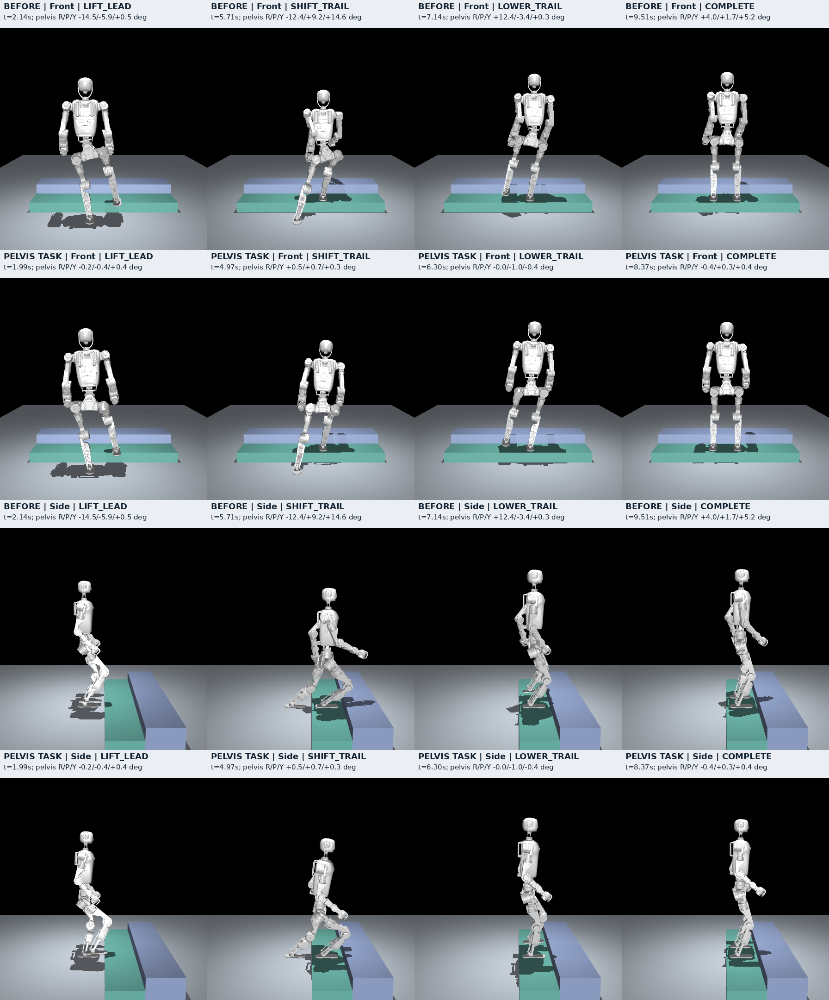

# MuJoCo 动作教师：2026-10-06

默认演示现已切换为 `DynamicTeachingEpisode` 动态教师。在 11 cm 高、32 cm 踏面、固定初始条件下，上楼与下楼分别完成一次真实物理动作，锁定目标后的动作时间约 **4.10 s / 4.44 s**。这仍是已知仿真几何、接触真值驱动的动作教师，**不是学习策略，未通过自然性和鲁棒性验收**。

默认 `--initial_forward_offset=.05` 在物理运行开始前将起始站位向台阶靠近 5 cm；它是明确改变的场景初态，不是机器人已经学会接近台阶。动作中没有瞬移、固定根节点或外加机身力，保留自由基座、真实碰撞和原电机力矩限制。包含开局观察的仿真时刻约为 4.39 s / 4.73 s；以下完成时间统一使用锁定后的 `motion_time`。

| 当前动态候选指标 | 上楼 | 下楼 |
|---|---:|---:|
| 名义完整动作时间 | 4.10 s | 4.44 s |
| 承重左/右腿最大正面侧斜 | 9.28° / 10.19° | 11.58° / 9.99° |
| 骨盆最大侧倾 | 约 1.09° | 约 1.10° |
| 最小关节限位余量 | 约 7.5° | 约 0.93°，源支撑左踝俯仰 |
| 执行器边界 | 本次审计未发现饱和 | 最大利用率 99.34%，源支撑左踝俯仰 |
| 质量标记 | `motion_quality_validated=False` | `motion_quality_validated=False` |

腿线角度按世界 y/z 平面中的髋到踝连线计算，只在该脚实测承重超过 60% BW 时纳入左右峰值；它与骨盆侧倾是不同指标，适用于当前沿 +x 的场景。上楼改善了原来约 18° 的斜撑及紧贴限位的问题，但数值改善和名义完成均不等于自然动作已经通过。下楼仍接近踝关节及力矩边界，不能称为具有足够控制余量。

下楼把起始前移量由 50 mm 改成 45 / 55 mm 的两个邻域试验，均在第一次计划落脚时未通过区域轻接触检查；增加短时等待也没有修复。目标向踏面内增加 3 mm 余量的隔离对照让邻域试验取得轻接触，但仍未取得连续有效支撑；增加到 10 mm 的试验也在 45 mm 起点确认后丢失支撑。这些都不能用于宣称鲁棒性通过。默认仍保留原下楼目标 x 偏移 −5 mm，实验变体未合并。落地后的后移可能发生在支撑确认之前，因此“已确认足部滑移很小”不能代替整个触地过程的滑移检查。

当前运行证据：`logs/dynamic_integrated/up/up_000.json`、`logs/dynamic_integrated/down/down_000.json` 及同目录的 `*_candidate.npz`。400 Hz 原型审计副本为 `logs/dynamic_integrated/up/prototype_400hz_quality.json`、`logs/dynamic_integrated/down/prototype_400hz_report.json`；两方向同目录的 `quality.json` 则是生产轨迹的 100 Hz 独立运动学审计，不能混称 400 Hz。下楼邻域失败仍保存在本机 `/tmp/repocopilot_down_dynamic/logs/closer045/`、`closer055/` 等实验目录。日志默认不随源码上传，临时目录也不是可下载数据集。旧版结果保留在下文，不能与当前动态结果混为一组。

新增 `tests/test_mujoco_stair_motion.py` 两项物理回归通过，检查实际上下楼完成、关节和力矩范围、承重腿侧斜、骨盆侧倾、最终支撑、重置对象身份与动作重现、轨迹对时。另有六项 COM 预览数值测试通过。固定场景回归只验证所测条件，不能替代自然性、邻域初态及扰动验收。

本次最终验证合计 112 项通过（110 项导入、几何、区域控制、接触、原教师和预览回归，加上上述 2 项动态物理回归）。独立 MuJoCo 环境未安装 Torch，因此 Torch/Isaac 相关测试未完成，不能把本次结果称为全仓测试通过。生产轨迹的正侧视完整回放与关键帧保存在 `logs/dynamic_integrated/videos/`；`render_manifest.json` 记录每一帧对应的原始状态，画面没有姿态插值或修正。

## 动态控制和验收边界

两方向共用逆动力学、足掌区域检查与实测接触门槛，但分别规划质心、摆腿和载荷切换。上楼采用恒高平面质心预览并另设身体升高参考；下楼采用规定高度轨迹和混合高低支撑面的近似三维质心预览。QP 可行及采样时刻合力/力矩通过，仅说明简化模型中的参考满足所检查条件，不证明全身关节可达、连续接触跟踪或机器人鲁棒平衡。

时间计划给出期望切换时刻，实测条件决定能否继续：起脚时摆动脚载荷不高于 8% BW、支撑脚不低于 60% BW；跟脚前必须确认前脚支撑；计划落脚时必须真实建立同一踏面内的轻接触。前脚连续有效支撑仍需至少 12% BW 及原连续确认时间。条件不满足会停止并报告失败，当前没有经过验证的在线重规划或恢复控制器。

最终双脚完整位于同一锁定踏面的安全支撑范围内，各自至少承重 20% BW、总载荷至少 80% BW，机身线速度低于 0.05 m/s、角速度不高于 0.30 rad/s，并连续稳定至少 0.25 s，才计完整动作。几何覆盖、净空、倾角、脚速和滑移判据继续参与验收；计时结束或底座越过终点不计成功。

当前共享踏面目标不要求双脚分别命中两个小矩形中心。内部足端参考点用于生成运动，真实落脚点用于后续支撑；绿色区域是已锁定观测覆盖的支撑范围，不代表任意边缘位置都能容纳整只脚。教师输入仍是已知仿真踏面点，窗口没有 D435i 实时深度输入。Torch 的 `stair_skill_teacher.py` 尚未同步这条动态控制和区域目标路径。

## 查看与复现

在本机已配置的独立环境中：

```bash
cd /home/hpf/haiwj/RepoCopilot
OPENBLAS_NUM_THREADS=1 /home/hpf/haiwj/.venvs/repocopilot-mujoco/bin/python \
  -m legged_lab.scripts.mujoco_stair_teacher \
  --controller dynamic --direction up --initial_forward_offset .05 --loop
```

下楼将 `--direction up` 改为 `--direction down`。`dynamic` 是默认值，`--controller staged` 可回看旧版逐阶段教师；`--initial_forward_offset` 只用于动态教师，不能把旧版初态与当前 5 cm 前移初态视为相同对照。

无窗口运行一个名义回合并保存独立报告：

```bash
OPENBLAS_NUM_THREADS=1 /home/hpf/haiwj/.venvs/repocopilot-mujoco/bin/python \
  -m legged_lab.scripts.mujoco_stair_teacher --headless \
  --controller dynamic --direction down --initial_forward_offset .05 \
  --output_dir logs/mujoco_stair_teacher/dynamic_down_20261006
```

窗口显示实际物理运行、阶段及左右脚实测载荷。绿色半透明区域显示锁定踏面的观测覆盖；未知孔洞保持留空。默认不显示两个内部足掌参考框，调试时可加 `--show_foot_targets`。`--loop` 每回合完成后明确重置再执行，不是连续多级楼梯；失败会停止并显示原因。无窗口模式不支持 `--loop`。

本机还修复了可视化刷新卡顿：逐帧调用 `viewer.set_texts` 实测约阻塞 0.99 s，而四个物理子步约需 0.008 s。现在屏幕说明只设置一次，实时阶段与载荷由场景文字标签更新。修复后的可视化运行已分别重复完成至少 5 次上楼和 4 次下楼；这是同一初态的循环复现，不是随机起点成功率。

## 数据与训练接口

新运行默认输出到 `logs/mujoco_stair_teacher`，可用 `--output_dir` 保存不同候选。只对物理成功回合导出 `*_candidate.npz`，报告字段为 `candidate_trace`；报告及轨迹保持 `motion_quality_validated=False`、`force_oracle=True`、`learned_policy=False`。已知几何在轨迹中标为 `known_geometry=True`，报告中则为 `geometry_source=known_simulation_treads`。这些文件用于物理动作诊断，尚不是可直接训练的学生数据集。

动态轨迹每 10 ms 保存步初 `qpos/qvel`，以及随后四个 2.5 ms 物理步实际施加的电机力矩。当前 `step_features` 只有 **12 维阶段 one-hot**，语义标记为 `phase_onehot_only_not_policy_observation`；它不是旧版 39 维楼梯特征，更不是学生的 1000 维历史观测，不能据其字段名直接接入训练。旧 `staged` 教师仍保存 39 维特征，两个格式必须按元数据区分。

轨迹另外记录关节名、采样周期、目标面片、内部参考足位和起始前移量，但缺少完整学生观测契约与等价位置动作。当前教师施加力矩，Isaac 学生输出位置目标；必须先验证同一位置控制接口，再记录对齐的状态、历史和动作标签。力矩不能直接当位置标签，12 维阶段标签也不能通过补零冒充完整策略观测。

使用 `python -m legged_lab.scripts.audit_mujoco_motion TRACE.npz --output audit.json` 可复核姿态、髋踝腿线侧斜、关节限位余量及身体下沉；下楼加 `--direction down`。同目录 JSON 用于匹配原始实测载荷，缺少它时不提供承重踝和承重腿指标。该工具重放运动学，不重新运行物理，不能把重算接触力当作原物理载荷。报告中的动力学残差是 QP 计划等式残差，不是实际接触力跟踪误差。

## 2026-10-05 历史基线与失败证据

本节记录动态教师集成之前的区域目标与姿态候选。原区域版本虽能完成固定场景上下楼，用户指出的歪胯、斜撑和对点搬脚仍然存在；不能用终点成功替代动作质量验收。以下“候选”均指当时版本。

上楼候选新增骨盆姿态控制、适度上肢姿态代价和小幅平滑躯干倾斜；采用脚掌内部的保守支撑点，并让抬脚与接近台阶重叠。固定 11 cm 台阶的物理对照如下，均来自整段状态回放而非挑选截图：

| 指标 | 原区域版本 | 当时上楼候选 |
|---|---:|---:|
| 骨盆最大侧倾 | 14.52° | 0.84° |
| 骨盆最大扭转 | 20.48° | 1.48° |
| 右肩俯仰偏离初始姿态 | 39.36° | 14.10° |
| 承重右踝最大侧倾 | 20.13° | 19.56° |
| 身体相对起点最大下沉 | 8.03 cm | 8.18 cm |
| 完成时间（仿真时间） | 9.51 s | 8.37 s |

歪胯和上肢代偿已有改善，但身体下沉没有改善，右踝距模型限位仅约 0.44°，准静态移重和分阶段停顿仍在。该候选不应直接作为合格的模仿学习示范。新的姿态及摆腿配置只用于上楼；下楼保留原控制配置，不能宣称下楼动作质量也已改善。

原始对照记录：`logs/local_mujoco_demo/20261005_202414_up_region` 与 `logs/posture_experiments/coordinated_swing_up`。

历史可视化候选目录：`logs/local_mujoco_demo/20261005_211540_up_motion_candidate`。相关控制、MuJoCo 物理和导入回归共 68 项通过；上楼回归新增全程骨盆姿态、肩部偏移与关节限位检查，下楼验证的是保留配置的物理完成。上述检查不替代动作质量验收。

进一步按髋到踝连线审计，当时上楼候选在 `LIFT_TRAIL` 的承重右腿仍侧斜 **17.91°**（5.22 s，髋踝横向差 13.77 cm、竖向差 42.61 cm）；这一帧骨盆侧倾约 0.56°。因此骨盆变平没有解决用户指出的整条支撑腿斜撑。完整指标见 [腿线审计](images/mujoco_motion_quality_20261005/support_leg_audit.json)。这是世界 y/z 平面的几何角，适用于该沿 +x 的台阶场景，不是从截图估计的角度，也不是通用合格阈值。

下楼隔离诊断尝试保持触地后身体高度、增加前移重及胸腔前倾、延长平滑移重，分别在 5.45、5.64、6.66 s 丢失已确认支撑；没有可合并的下降改进候选。随后研发转向有时间参数的质心与足端位置、速度、加速度协同，而非继续只调整静态骨盆姿态。逆动力学接口已支持可选前馈，新增双脚真实支撑下的平滑质心移动回归通过；原 68 项回归再次通过。当时默认演示仍使用前述配置，前馈接口的基础测试尚不能证明动态上下楼完成；本节记录的是动态集成之前的证据。

实现方向为**共用基础控制，上下楼分别设计动作与验收**：共用观测踏面覆盖、实际支撑锚点、接触读取、全身逆动力学及关节/力矩限制；分别规划身体高度、足端轨迹、摆腿时长及接触载荷切换。上楼要求整脚净空后向前落脚、承重后抬升身体；下楼要求高处支撑腿屈曲配合前脚下降、控制触地速度，并在低处脚稳定承重后卸载后脚。下楼动作不能由上楼参考简单取负或倒放得到。

早期动态探针保存在本机 `logs/dynamic_probe/`，当时与默认演示分离，标记为实验而非专家轨迹。恒高简化质心预览已能产生可行的平面参考，起脚前增加 60 ms 卸载安排后，实际摆动脚载荷约 4%–5% BW，通过原 8% 起脚条件。但该批早期实验的完整物理回合尚未完成：较快摆腿先暴露整脚边缘净空问题；修正轨迹及触地连续确认后，上楼前脚已经落地承重，后脚在计划起脚时仍承重 11.3% BW，按原 8% 条件停止；下楼前脚仍未在计划时刻接触较低踏面。不能把局部阶段倾斜较小或预览优化可行当作全过程通过；这些失败推动了后续按方向协调三维质心、足端可达性及接触时序。




旧版作者设备上的报告与轨迹路径仍保留为历史记录，文件是否存在取决于数据是否同步：

- `logs/mujoco_stair_teacher/final_up_20261005/up_000.json`
- `logs/mujoco_stair_teacher/final_up_20261005/up_000_expert.npz`
- `logs/mujoco_stair_teacher/expert_down_20261005/down_000.json`
- `logs/mujoco_stair_teacher/expert_down_20261005/down_000_expert.npz`

历史 `expert` 命名不代表通过自然性或鲁棒性认证。原盲走权重没有因动态教师完成而改变，原楼梯 Actor 也没有自动学会新动作。

## 后续顺序

1. 先扩大上下楼全过程质量审计与初态邻域检查，优先解决下楼源踝余量、触地后后移及连续支撑确认；同时保留骨盆、腿线、关节/力矩余量、身体升降和完整视频证据。名义成功不作为质量通过。
2. 对齐学生的位置动作、观测历史和轨迹格式，并同步 Torch 路径的区域目标语义；该接口先在物理中完成动作，再开展模仿训练。关闭动作教师验收策略独立执行，随后接回真实深度。
3. 独立策略稳定完成单级后，再扩展到无中途重置的连续楼梯及初态、地形扰动。当前结果不能外推到多级、斜坡、鹅卵石、无足力传感器闭环或真机。
