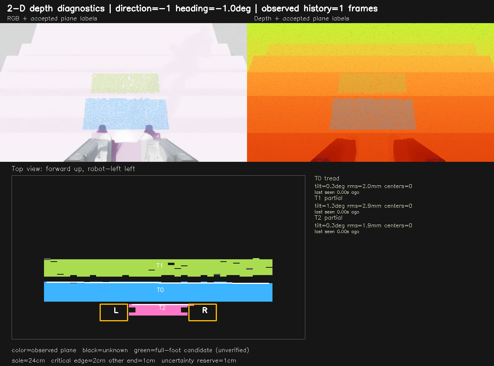
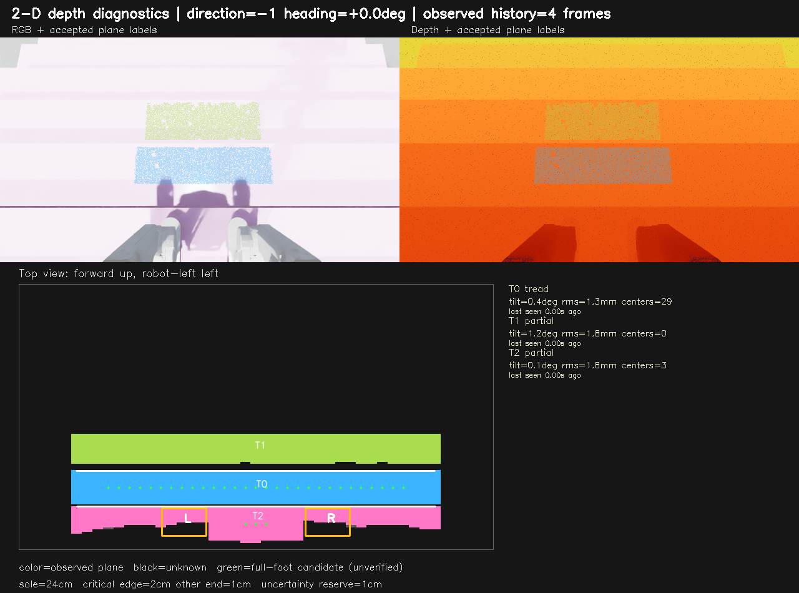

# 台阶平面与完整脚掌安全区域

## 已实现与边界

深度反投影、局部法向排除立面、水平面拟合、整脚安全区域、位姿补偿短时地图和独立真值审计已实现。源数据来自 Isaac RTX 或 MuJoCo 渲染；尚未完成物理 D435i 与真实状态估计误差验收。

二维诊断使用 1280×720 原始图像、640×360 处理；旧策略一维几何分支仍为 160×90。短时地图最多保留 25 帧/1 秒，按当前位姿重投影，过期、重置或位姿突变后清除；未知孔洞不补成可踩面。

| 项目 | 当前二维检查约定 |
| --- | --- |
| 脚掌长度 | 24 cm |
| 关键净距 | 上楼脚跟、下楼脚尖 2 cm，另一端 1 cm |
| 名义误差预留 | 纵向两端各 1 cm；理想有效踏面至少 29 cm |
| 最终平面 | 倾角 ≤5°、拟合残差 ≤15 mm |
| 局部法向滤波 | 窗口 7×7、差分半径 4 px；45°仅用于抗噪分类 |

绿色候选表示观测覆盖和整脚几何条件成立，不证明关节可达、实际接触或动态承重。左右同级覆盖是诊断指标，不是新主线逐级并步要求。

## 已有证据

2026-10-03 最终配置回放旧 58 帧和新增 128 帧，均未发现候选净距或高度违规；另有 52 帧在线采集、14,035 个地图候选，两项违规为零。统计是候选检查，不是落脚成功率。受控补充视角可取得下一阶左右候选，常规下楼中段仍可能因遮挡没有完整目标；尚未证明机器人能稳定主动取得这些视角。

原始图像、深度、配对位姿及报告保留于 `logs/stair_surfaces_32cm/`。早期失败也保留，不与最终配置混合。图中黑色为未知、绿色为候选、橙框为实际足掌投影。





## 复现

从仓库根目录、已配置环境离线回放保存数据，无需启动 Isaac Sim：

```bash
python -m legged_lab.scripts.replay_stair_surfaces --input_dirs logs/stair_surfaces_32cm/refinement_20261003_15cm_final_seed42 --output_dir logs/perception_runs/replay_15cm --surface_memory --save_images --normal_window_size 7 --normal_radius 4
```

重新采集 RTX 图像需 Isaac Sim 环境。以下盲走权重仅用于采样时驱动机器人，不代表它能上下楼：

```bash
python legged_lab/scripts/inspect_stair_surfaces.py --headless --surface_memory --seed 43 --heights 0.15 --walking_steps 160 --capture_every 10 --normal_window_size 7 --normal_radius 4 --checkpoint logs/retained/baselines/elf3_blind_v18/model_43997.pt --output_dir logs/perception_runs/capture_15cm_seed43
```

核心实现：[tread_surfaces.py](../legged_lab/perception/tread_surfaces.py)、[surface_memory.py](../legged_lab/perception/surface_memory.py)、[surface_audit.py](../legged_lab/perception/surface_audit.py)。渲染深度接入动作教师的命令见[教师文档](mujoco_action_teacher.md)。
