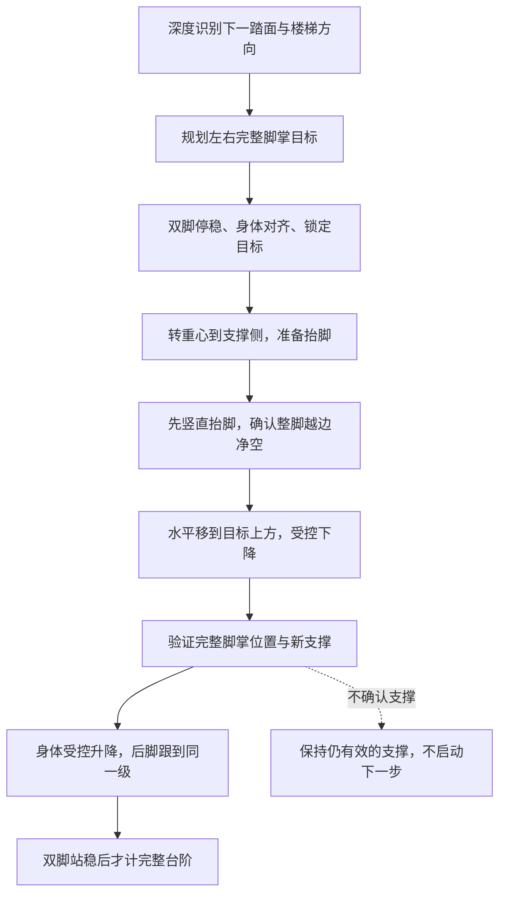

# 没有足底传感器时如何继续楼梯训练

更新日期：2026-10-03。硬件条件已确认：目前可读关节位置、关节速度和 IMU，不能读取关节实际力矩或电机电流，也没有足底力传感器。

## 当前承重判定是什么

Isaac 环境从物理接触引擎取得每只脚的世界坐标接触力。用 `Fz / (机器人质量 × 重力)` 描述载荷，再联合几何和运动检查：脚掌完整落在指定踏面、平面贴合、脚速较低、没有明显滑移，以及连续稳定时间。

现有摆动脚卸载 8%、支撑脚至少承重 60%、最终双脚各至少 20% 等条件，是**仿真教师和验收口径**，不是硬件测量值。碰到踏面、脚踝中心进入绿色区或者等深度稳定，都不能单独证明脚已经接住身体。

本次改动已将直接载荷和力反馈确认的支撑标志从 Actor 的 39 维阶段特征中移出，对应四个位置保持为零，以保留 1000 维接口。Critic 和训练验收仍保留这些真值。

重要限制：阶段、执行目标和成功事件目前仍由读取仿真接触力的阶段管理器产生。因此屏蔽四个 Actor 特征不等于完成无足底传感器部署，也不等于整个控制闭环已经摆脱接触真值。

## 现有传感器能判断什么

关节位置和机器人模型可计算脚掌相对机身的位置、姿态、完整轮廓及质心位置；关节速度可参与脚端运动估计；IMU 给出机身姿态、角速度和加速度信息。结合深度几何、相机外参和时间同步，可评价脚与踏面的距离、脚掌是否越边、身体是否明显倾斜或运动。

这些量可以用于学习或估计接触状态，但不能可靠、唯一地还原左右脚各承担多少重量。特别是双脚几乎不动时，不能因为低脚速就声称各承担 50%。质心投影和支撑多边形有助于规划缓慢转重心，也不是实际载荷传感器；接触压力中心、运动加速度和模型误差都会影响真实受力。

关节运动学也只直接给出机身相对位置。把脚和跨帧深度地图放进同一坐标系，还需要机身运动估计；IMU 不会直接给出无漂移的世界位置。当前仿真位姿尚未替换为真机状态估计器。

当没有可靠载荷反馈时，`StepMeasurement.contact_forces` 必须是 `None`，而不是伪造零值或按站立分配重量。当前管理器仍能显示几何目标预览，但不允许以“已卸载”或“已承重”推进起脚；中途失去反馈会终止仿真回合。`RECOVER` 仍不是可用于硬件的平衡恢复控制器。

## 抬脚到前面楼梯的流程

阶段管理器输出目标、阶段和连续参考，不会直接生成一个能保持平衡的关节动作。策略需要学会支撑腿、骨盆、躯干与摆动腿的协同，输出关节控制目标，由底层控制器执行。

上楼先抬到高于上一级踏面，再越过立面。下楼先越过当前前缘，随后低速接近下一级；身体下降必须受控，不能靠惯性或滑落到下方。两个方向都要保持楼梯航向，落脚后确认新支撑才跟脚。RGB 不需要看到双脚；位置检查以运动学和深度地图为主。

## MuJoCo 怎么验收

MuJoCo 不需要硬件足底传感器或 MJCF `<touch>` 元素，就可以读取物理引擎中的接触力。官方 [`mj_contactForce`](https://mujoco.readthedocs.io/en/stable/APIreference/APIfunctions.html#mj-contactforce) 返回接触坐标系中的力与力矩；接口必须转换世界坐标，正确处理接触两侧的符号，再累加到对应脚。

新增 `legged_lab/perception/mujoco_support.py`：按实际 body 名解析左右脚，用引擎雅可比计算完整脚掌中心的速度，读取外部接触并排除机器人自碰撞。默认不提供接触真值；只有显式 `include_contact_truth=True` 才返回力。调用前需同步 MuJoCo 运动学与接触状态。

五项 MuJoCo 物理测试通过，包括无任何传感器时的向上受力/重量平衡、悬空无力、默认未知载荷及脚掌偏置速度。本机实际 ELF3 MJCF 在内存中移除 `lf_touch`、`rf_touch` 后也成功加载，解析机器人质量约 37.87 kg，能够读取脚姿态与引擎接触。该加载检查没有演示真实 ELF3 上下楼成功。

现有 `amp_sim2sim_lite.py` 仍是 960 维盲走入口，尚未接深度、二维地图和楼梯阶段。已加入输入维度检查，拒绝把 1000 维楼梯模型当作盲走模型运行；不能补零凑维度来声称完成迁移。完整楼梯 sim2sim 还要对齐关节顺序、动作缩放、PD、脚掌碰撞几何、相机外参与时间同步。

## 本批推进与下一步

真值拆分这批共 97 项测试通过。Actor/训练真值拆分后的 Isaac 下楼检查运行 120 步，59 步有双脚几何计划，仍是 0 次完整台阶成功。观察阶段未满足条件的帧数为：目标 45、机身速度 66、脚速 62、双脚载荷 64、角速度 9、总载荷 3。各项可重叠，不是独立失败回合数。

新增停稳训练信号，专门惩罚观察和最终站稳时的机身平移、脚部运动和角速度；抬脚与转重心阶段不受这套停步惩罚。小规模训练管线检查用于验证更新和保存，不作为效果训练。

后续 v2 已接入观察阶段的主动航向对齐，并把楼梯动作改为由原盲走权重初始化的完整可训练 Actor：平地仍使用冻结盲走，楼梯阶段允许学习停步和支撑转换，而不只是给持续盲走叠加小残差。当前共 107 项测试通过；单环境 32 轮短训练已完成，但训练日志没有完整台阶成功，240 步确定性回放仍停留在观察阶段。这说明网络更新不等于动作已学会。此修改没有去掉阶段管理器对仿真载荷的依赖，详见 [stair_step_phase2.md](stair_step_phase2.md)。

下一步首先让仿真教师下的单级动作达到可重复成功，再对接触/支撑状态估计进行监督训练和独立验证，评估估计延迟、误触地与滑移漏检，并用估计值替代阶段管理器的真值输入。没有足底力反馈不意味着不能训练行走，但不能宣称已经获得精确承重闭环。完整无传感器闭环、MuJoCo 楼梯迁移和真机稳定性均未完成。
