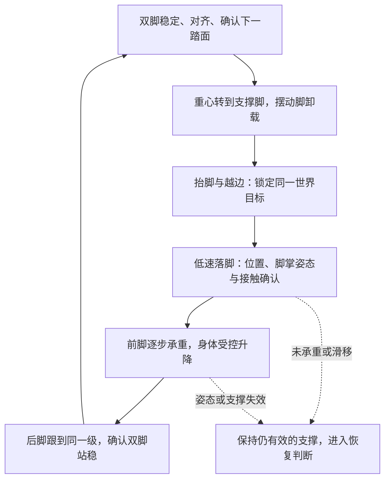

# ELF3 上下楼梯：32 cm 踏面与逐级落脚方案

更新日期：2026-10-03。

**实现状态：第一阶段感知检查已收尾。新独立单级任务已将二维观测地图、世界目标锁定、卸载/抬脚/落脚/跟脚/双脚站稳阶段和新奖励接入策略；上下楼的真实初始化检查仍停在观察阶段，尚未学会动作。第二阶段实现和限制见 [stair_step_phase2.md](stair_step_phase2.md)。以下设计中尚未实现的安全恢复、动力学稳定和多级训练不能据此视为完成；旧模型也不能称为已经学会逐级站稳。**

## 1. 共用哪些部分，分开哪些部分

上下楼共用深度投影、平面验证、踏面跟踪、脚掌安全区、楼梯方向估计、承重确认和阶段管理。上楼、下楼分别使用摆脚轨迹与身体高度参考；初期分别训练和验收，避免一项技能的进步掩盖另一项的失败。两者稳定后，再混合训练方向条件策略并接入完整赛道。

非楼梯仍使用原盲走底座。楼梯技能需要同时控制骨盆、支撑腿和摆动腿，不能只在原步态上加一小段脚端 IK。冻结盲走加小残差的旧实验没有形成可靠支撑转换；新楼梯分支的动作权限和参考轨迹必须一起训练。

当前楼梯课程与融合赛道的上下楼踏面均为 0.32 m，台阶高度保留 0.11–0.16 m。先固定宽度，验证稳定逐级落脚。原 `course_width_level` 和 `Curriculum/stair_width_level` 字段暂保留兼容日志，当前等级实际改变台阶高度，不再收窄踏面。

实际 URDF 脚部碰撞网格的纵向范围为踝点后方 9 cm、前方 15 cm，完整长度 24 cm，宽 8.4 cm。旧奖励的 20.6 cm 范围不是完整脚掌。32 cm 踏面若前后各留 5 cm，将根本没有完整脚掌的可行位置。

按最新要求，新二维诊断采用方向相关净距：上楼脚后跟距近棱边至少 2 cm，下楼脚尖距前方下一落差棱边至少 2 cm；另一端留 1 cm，整脚不得悬空。纵向两端各额外预留 1 cm 感知误差，横向留 1 cm 并再预留 1 cm。24 cm 脚掌加纵向余量合计 29 cm，在理想 32 cm 踏面上留下 3 cm 的中心可调范围，而非保证实际永远有可行位置。斜踩、遮挡、边界误差增大或观测缺失时，应拒绝目标。1 cm 是当前名义误差预留，不是经过真机标定的误差上界。

这套新净距已用于独立第二阶段任务的目标与支撑检查，但没有替换旧任务的奖励或旧一维绿色区间；新策略尚未达到 2 cm 的实际落脚精度。

## 2. 感知需要补足的内容

旧 Actor 的输入仍是中央走廊的一维高度区间，并非完整三维平面。合成数据检查确认：仅左侧有点和左右都有点可输出相同旧特征；每个踏面倾斜约 11.3° 的阶梯仍可得约 0.86 的旧评分；三阶上楼接平台的旧轮廓只输出前两个踏面。这些检查定位旧算法缺口，不代表真实深度相机的误差或成功率。新二维诊断与短时地图已经补上平面、覆盖、脚掌候选、观测时间和跨帧 ID；独立第二阶段任务使用其目标和阶段特征，旧任务输入保持兼容。

保留棱边识别作为候选生成，增加以下验证：

1. 对每个候选踏面保留二维点分布，拟合局部平面，检查法向与重力方向夹角、拟合残差和有效点覆盖。点云离群点不能通过取最高点代表整片踏面。
2. 输出左右边界与实际已观测区域。缺深度、被遮挡和不连续区域保留未知状态；左右脚必须分别验证各自的支撑区域。
3. 利用多帧位姿补偿跟踪平面和台阶 ID，分别记录直接观测、历史观测和几何推断。推断出的台阶可以引导继续观察，不能直接当作已确认的落脚面。
4. 对楼梯末端的平台单独检测水平连通区域，不要求它必须由两条同向立面棱边围成。平台只有前缘或远端超出视场时，落脚位置仍须被实际观测覆盖。
5. 从三维棱边拟合楼梯前进方向，建立楼梯坐标系。脚端、身体位置、目标和安全余量均在该坐标系评价。

输出至少包括：平面高度与法向、二维已观测边界、安全脚掌中心区域、近棱边和立面高度、楼梯航向、台阶 ID、观测时间与几何不确定度。原图中的 `confidence` 是启发式评分，不能解释为安全概率。

32 cm 下的深度边界误差需要重新测量；旧下楼 -6.5 cm 补偿来自特定仿真分辨率和旧地形，不能未经验证就当作上下楼通用标定。验证应覆盖站立、迈脚、躯干俯仰和末端平台，分别统计前后边界误差、横向覆盖和目标可用时长。

## 3. 将三个动作阶段补成支撑闭环

“抬脚、落脚、双脚站立”作为第一阶段目标是合理的。实现时还要显式处理起脚前的支撑转换，以及前脚承重后另一只脚跟到同一台阶。初期采用逐级并步：同一级先后放下两只脚，保持左右间距，不要求轮流跨级。

目标在起脚前选定，整个摆动期间保持台阶 ID 和世界坐标一致。前脚到达新台阶后，后脚的目标必须是该同一级，而不是选择器再次自动选择下一个高度。

阶段转换由实际事件触发，计时只用于最短确认时间及失败超时。超时不能自动启动下一步；失去支撑时也不能只把速度命令置零后继续等待。

## 4. 上下楼的动作差异

| 动作 | 上楼 | 下楼 |
| --- | --- | --- |
| 起脚与越边 | 脚尖在跨过近棱边前高于上一级立面 | 适度抬脚，整脚越过当前台阶前缘，避免擦边和脚跟挂住 |
| 接近踏面 | 越过立面后降到上一级目标，降低触地速度 | 对准下一级已观测安全区后下降，接近踏面时降低下降速度 |
| 身体升降 | 前脚承重后协调两腿抬升身体 | 支撑腿受控屈膝，协调降低身体，抑制向前冲和向下坠落 |
| 换支撑 | 上一级前脚可靠承重后，后脚跟上 | 下一级前脚可靠承重后，才卸载上一级后脚并跟下 |
| 双脚停稳 | 两脚同级、姿态与速度收敛，再开始下一步 | 同样要求两脚同级、承重稳定、无持续滑移，再下一级 |

身体高度控制必须与前脚触地、承重进度协调；不能在前脚尚未到达时让支撑腿过度屈膝，也不能在触地后继续按原盲走节律把身体推出去。脚端轨迹本身不能控制这部分动力学。

## 5. 如何区分稳步下楼和滑落

新阶段管理器应持续联合检查这些条件，而非只看前进距离或脚碰到踏面：

- 已锁定台阶上的脚掌位置、朝向和有效支撑面积满足安全区要求；实际高度与目标平面一致。
- 接触力主要向上且达到任务需要的承重比例。现有 5 N 只适合识别接触，不能单独证明新支撑脚已接住身体。
- 支撑脚的平面内速度和累计滑移低，脚掌没有继续越过边缘；落脚时的竖直速度与冲击也受控。
- 新支撑建立前，旧支撑不提前释放；身体向下速度、前向速度、横向速度和侧倾在当前阶段允许范围内。
- 两脚同级站立时，质心投影有支撑余量且身体速度低；单脚阶段还需考虑动态稳定，不能只使用静态质心投影。

初期可以把稳定确认窗口设为约 0.1–0.2 s，具体阈值需按机器人质量、传感器噪声和步态实验调整。现有 3 帧、约 60 ms 的确认可以保留为诊断，不足以直接代表新双脚站稳阶段。

“落脚后等一下”有作用的前提是可靠支撑已建立，并且姿态控制仍持续工作。仅等待深度图稳定，无法阻止已失去支撑的身体下滑。

## 6. 上下楼都必须走正

对齐参考使用实际楼梯棱边确定的前进方向，不能只依赖仿真世界的 +x。分别评价机身航向、足部航向、楼梯内横向位置与横向速度。

大幅航向修正放在双脚支撑阶段。起脚前确认横向落脚区和机身对齐；单脚阶段以保持稳定、限制漂移为主。后脚跟随也使用左右分开的二维目标，防止身体对齐但脚掌斜踩。

若下一级可踩区域因偏航或遮挡不可确认，应在仍稳定的支撑状态重新观察和对齐，不应继续沿旧目标向前走。训练需包括小角度初始偏航和横向偏移，分别测试上楼与下楼恢复。

## 7. 策略和奖励需要共同适配

新楼梯分支接收方向、阶段、支撑脚、目标误差、对齐误差和承重状态；阶段不仅用于日志，还要影响动作参考、训练观测与奖励。

双脚等待和重心转移阶段不应被原前进速度奖励、最低速度奖励和固定周期步态惩罚催促迈步。摆脚阶段评价越边净空、轨迹误差和目标可达性；落脚阶段评价有效支撑与触地速度；承重和跟脚阶段评价身体稳定、滑移与支撑转换。只有同级两脚稳定确认后，才计一次完整台阶进度。

不能只以奖励项替代控制闭环。需要在阶段参考、足端动作和身体稳定共同参与的训练中学习，否则旧盲走节律与手工脚端修正仍可能互相干扰。

## 8. 实现与验收顺序

1. 32 cm 上下楼及末端平台的二维感知误差、覆盖与时序检查。
2. 单台阶上楼和下楼，分别验证转重心、落脚承重及后脚跟随。
3. 两级、四级、八级楼梯，先 11 cm，再提高到 15–16 cm。
4. 加入偏航、横向偏移、深度丢点和延迟，检查稳步下楼与走正。
5. 混合上下楼训练，再接上下坡和鹅卵石赛道；检查非楼梯盲走是否退化。

新验收必须记录每级双脚稳定完成、支撑滑移、触地速度、危险首次触地、非足部碰撞和对齐误差。仿真独立真值用于核验感知和完成率，不作为实机 Actor 的可部署观测。旧单脚覆盖指标与新双脚并步指标应分开记录。

## 9. 不需要摄像头看见双脚才能验收

深度图在策略外投影和拟合几何；策略接收几何与自身状态，而不是原始 RGB 像素。旧任务 Actor 仍使用一维特征；独立第二阶段任务已接收二维目标、阶段、指定台阶误差和承重状态。抬脚、落脚、身体受控升降和支撑转换仍需训练验证。

双脚位置由关节编码器和机器人运动学求出，结合 IMU、机身位姿估计及相机外参，与深度踏面变换到共同坐标系。逐个脚掌检查完整轮廓、朝向、2 cm 关键净距、高度贴合、有效接触、承重比例与低滑移；不能只检查脚踝中心落在区域内。实机若没有足底力传感器，可使用经过标定的关节力矩接触估计，但其不确定度需单独验证。

摆脚阶段允许摆动脚离地，主要确认支撑脚仍有效；落脚阶段确认新脚已接住身体；同级双脚站立阶段才要求两脚位于指定台阶的左右目标区域并持续稳定。足部进入视场近盲区后，拟议的新控制需使用时间同步、位姿补偿后的已观测局部地图，不能把历史失效区域当作当前安全区域。RGB 中看脚只用于人工回放辅助，不是主要闭环反馈。

仿真可以另用真实碰撞地形和物理接触独立核验，防止感知自报“安全”后用同一误差自证成功；此真值不得送进部署 Actor。
