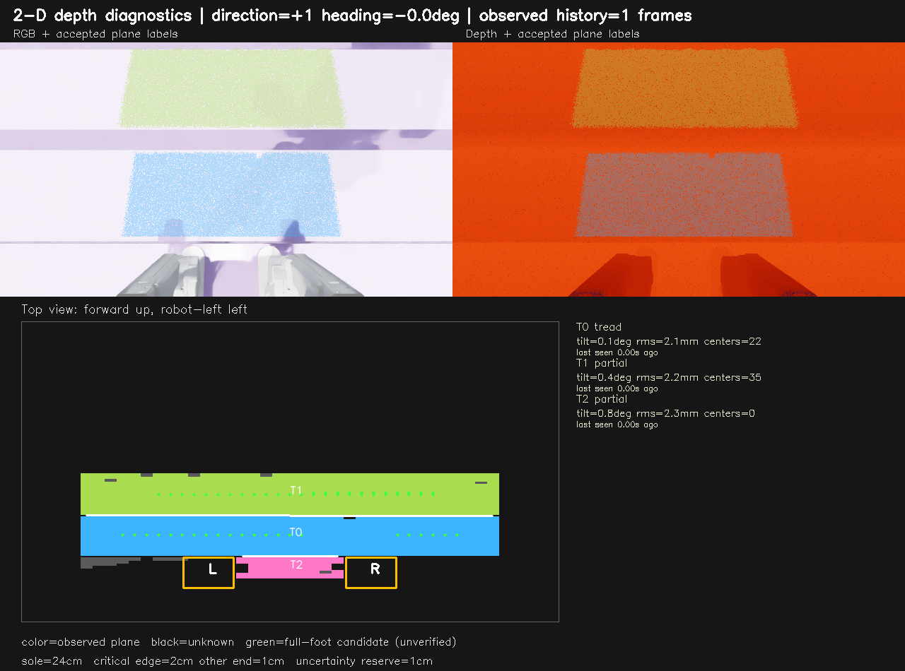
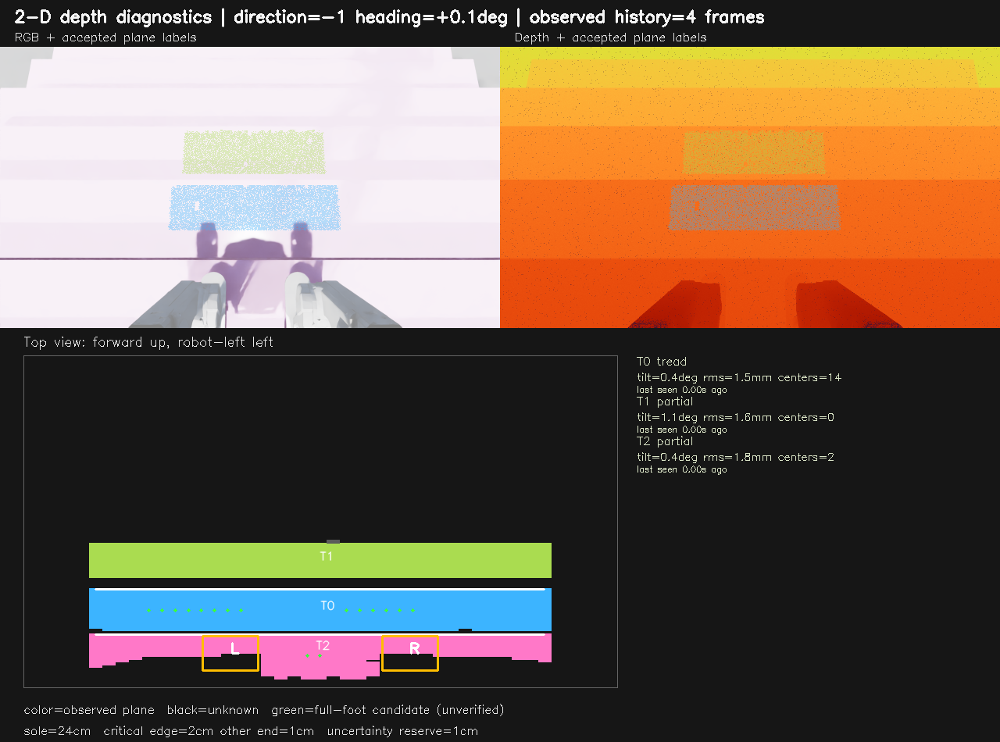
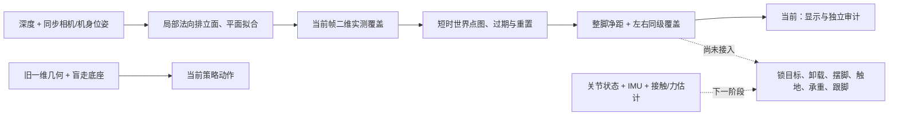

# 楼梯二维感知修复与跨帧观测验证

> 历史报告：2026-10-08 从提交 [`e281140`](https://github.com/hywxj/RepoCopilot/tree/e281140) 恢复，保留 2026-10-03 的实验结果与图片。验证范围是仿真深度中的平面、整脚候选与短时地图，不包括实际上下楼能力；文中的“当前 / 下一阶段”和逐级并步方案描述当时状态。恢复分支的使用入口与当前范围见[感知文档](perception.md)。
>
> 下文 `logs/stair_surfaces_32cm/` 中的大规模 RGB、深度、位姿及报告属于本地实验数据，不随 Git 上传；克隆仓库后不会自动拥有这些历史记录。图片已保留在 `docs/images/`，回放请使用当前感知文档中的示例或本机保留数据。

日期：2026-10-03。范围：感知与诊断，不是新策略训练，也不是机器人已学会上下楼。

## 结论

旧数据中实际留存原始 RGB/深度/位姿的是 58 帧，而不是第一批报告记录的全部 70 帧。相同 58 帧的独立脚掌净距违规由 17 个降到 0，最终滤波配置仍保留 19,671 个候选。不能把未留存的 12 帧算作已回放。

先用较大的法向滤波窗口采集 128 帧仿真 RTX D435i 图像，覆盖 11/15/16 cm 高度、32 cm 踏面。候选没有净距或高度违规，但 15 cm 补充观察后的左右覆盖不完整。随后将法向窗口从 9 x 9、差分半径 6 px 改为 7 x 7、4 px：最终配置在旧 58 帧及新 128 帧回放中均无违规，且四组下楼补充视角都得到同一级左右候选。

最终配置另做 15 cm、种子 42 的 52 帧在线采集，14,035 个地图候选中净距及高度违规均为 0，补充观察后的左右覆盖也成立。**这只说明这些帧中的候选通过了检查，不能推出整个运动过程安全，也不能作为真机误差界。**

剩余缺口是让机器人主动进入合适的观察和支撑姿态：常规下楼中段仍可能没有下一阶完整候选；受控观察姿态已能得到目标，不等于机器人已经学会稳定执行该姿态。盲走采集的下楼过程仍经常没有下一阶目标。目前不启动新训练，不把新地图接入旧 Actor。

## 修复内容

1. 从原生深度独立采样二维点云，使用逆深度局部法向排除立面底部混入水平踏面的点。最终法向平滑窗口为 7 x 7，差分半径 4 px，减少真实边缘附近的过度裁剪。局部法向阈值 45° 用于抗噪分类，最终平面仍要求倾角不超过 5°、拟合残差不超过 15 mm；45° 不是允许斜面落脚。没有放宽 2 cm 净距，也没有把未知区补成平面。
2. 下楼棱边以可见上层踏面的末端为保守观测边界，不再取上、下层点的中点。下层近边可能被遮挡；间隙只用于关联相邻平面，不填成可踩区。
3. 完整脚掌与栅格用相同的矩形相交检查。增加格内中心偏移搜索，避免有位置能放下整脚，却恰好落在两个 2 cm 栅格中心之间被漏掉。审计和显示都读取实际偏移后的中心。
4. 短时地图保存已验证的实测点，转换到世界坐标后，再按当前机身位姿投回。最多保存 25 帧 / 1 s；未知孔洞不补全。地图覆盖到机身后方 35 cm，脚边实测点也先独立验证，不能先被旧前方 15 cm 的观察区域裁掉。
5. 平面 ID 在小幅平移和偏航时保持关联；新旧高度冲突时删除旧点；环境重置、时间倒退或位姿突变时清空。相机停帧时仍按当前传感器时钟过期、重投影历史，不靠帧计数假定观测时间。
6. 报告分开记录当前帧与地图、当前平台与下一高度、左右脚候选和同一级双脚候选。后者只是横向覆盖检查，不是逆运动学可达或动态承重证明。

新诊断保留用户要求的上楼脚跟 / 下楼脚尖关键净距 2 cm，另一端 1 cm；纵向两端另加名义误差预留各 1 cm。脚掌长 24 cm，理想踏面至少需要 29 cm 的有效覆盖。旧一维奖励、旧边界补偿和旧 Actor 特征没有被这轮替换。

## 数据与核验

来源是 Isaac Sim RTX，不是物理 RealSense 录制。原生图像 1280 x 720，二维处理 640 x 360，旧策略几何处理仍为 160 x 90；RGB 仅显示。深度加入 5 mm + 距离的 1% 高斯噪声及 0.5% 丢点，使用仿真精确位姿补偿，尚未检查真实外参和里程计误差。

以下是法向窗口 9 x 9 / 6 px 时的在线采集历史，保留用于对照，不是最终窗口的候选统计。

| 初次修复采集 | 帧数 | 地图候选数 | 净距违规 | 高度违规 |
| --- | ---: | ---: | ---: | ---: |
| 11 cm，种子 42，受控姿态 | 20 | 6,927 | 0 | 0 |
| 15 cm，种子 42，姿态及盲走 | 36 | 10,297 | 0 | 0 |
| 16 cm，种子 42，受控姿态 | 20 | 6,975 | 0 | 0 |
| 15 cm，种子 43，姿态及盲走 | 52 | 12,614 | 0 | 0 |
| 合计 | 128 | 36,813 | 0 | 0 |

候选数量是逐帧栅格计数，不是独立试验数，也不是已执行落脚次数。真值由生成地形的独立上包络给出；检查完整脚掌加关键物理净距是否跨棱边，并检查目标高度误差是否超过 2 cm。真值仅用于核验，不参与感知选区或策略观测。此次核验未覆盖真实磨损边缘、杂物、湿滑或承重能力。

跨帧在线实现中的一个早期版本仍发现 5 个违规，最坏约 2.9 mm；该失败保留在 `logs/stair_surfaces_32cm/refinement_20261003_15cm/report.json`，不计入上表。脚边入口修复后的数据使用 `refinement_20261003_15cm_near_roi`，不能把旧版本的失败藏入新版成功统计。

最终窗口 7 x 7 / 4 px 回放这 128 帧，得到 35,734 个地图候选，净距和高度违规均为 0；旧 58 帧单帧回放得到 19,671 个候选，也均无违规。最终在线采集则在 `refinement_20261003_15cm_final_seed42/`：52 帧、14,035 个候选、两项违规均为 0。离线只处理被保存的帧，在线处理每个新相机帧，因此候选总数不能直接比较，不能宣称完全复现在线历史。

### 下楼中段的双脚覆盖

受控补充视角是在同级机身前移 12 cm、俯仰 8°，不是已经证明平衡的机器人动作。下表比较同一静态序列在两个滤波配置下的离线观测地图。左右候选按当前各脚横向位置允许调整 8 cm 检查，同级并步要求横向分开至少 16 cm、前后差不超过 8 cm；还未检查关节可达性、碰撞和动态支撑。

| 高度 / 种子 | 旧窗口：补充视角候选 | 旧窗口：左 / 右 | 最终窗口：候选 | 最终窗口：左 / 右 |
| --- | ---: | --- | ---: | --- |
| 11 cm / 42 | 22 | 1 / 8 | 29 | 8 / 8 |
| 15 cm / 42 | 9 | 8 / 0 | 29 | 8 / 8 |
| 16 cm / 42 | 14 | 5 / 5 | 29 | 8 / 8 |
| 15 cm / 43 | 15 | 0 / 8 | 29 | 8 / 8 |

最终窗口在以上四个补充视角中均有同级双脚候选；常规中段姿态仍没有双脚同级完整覆盖。最后一次在线 15 cm 采集也得到 29 个下一阶候选、左右各 8 个，且同级覆盖成立。

这解释了为什么“识别到踏面”和“能稳定逐级走”不能画等号。原盲走在无完整目标时仍按自己的节律迈脚；本轮地图是诊断，没有改它的动作，不能声称感知已真正约束落脚。

## 实际图像

每幅上方左侧为 RGB，右侧为深度及当前帧平面标签；下方为当前机身坐标系的观测地图。黑色是未知，绿色点是完整脚掌候选，橙框是运动学给出的左右实际脚掌。`T` 是观测跟踪 ID，不是地形真值台阶编号。绿色不是实际承重或成功落脚。

下面先保留早期 9 x 9 / 6 px 的四张图作为对照，再给出最终窗口的新采集图。上楼 15 cm 中段：新候选没有延伸到前方立面。



下楼 15 cm 常规姿态：能识别水平面，但有效覆盖不足，候选为零。


下楼 15 cm 补充观察后：记忆给出 9 个下一阶候选，但只覆盖左脚侧。


下楼 16 cm 补充观察后：有左右侧同一级候选，但尚未执行落脚或验证承重。



最终窗口的 15 cm 新在线采集：29 个下一阶候选、左右各 8 个。它修复了上面只覆盖左侧的问题，但仍不是实际承重或已训练动作。


## 当前与下一阶段



下一步不是直接增加训练轮数。受控补充视角下的双侧覆盖已经补齐，需要让机器人在真实运动中稳定获得它，并让新阶段管理器只在同一踏面有完整、仍有效且可达的左右目标时允许起脚；无目标时只能在已确认支撑中继续观察和对齐。随后分别做单级上楼、单级下楼，检查前脚承重后才释放后脚、身体受控下降、两脚同级站稳和低滑移，再扩展到多级训练。

## 复现

不需要激活 shell 环境也可以使用本机完整解释器路径。采集 15 cm 的第二随机种子：

```bash
/home/hamlet/miniconda3/envs/isaac_sim_env/bin/python -u legged_lab/scripts/inspect_stair_surfaces.py \
  --headless --surface_memory --seed 43 --heights 0.15 \
  --walking_steps 160 --capture_every 10 --normal_window_size 7 --normal_radius 4 \
  --output_dir logs/stair_surfaces_32cm/recheck_15cm_seed43
```

新采集的原始数据及 JSON 在 `logs/stair_surfaces_32cm/refinement_20261003_{11cm,15cm_near_roi,16cm,15cm_seed43}/`。离线回放：

```bash
/home/hamlet/miniconda3/envs/isaac_sim_env/bin/python -m legged_lab.scripts.replay_stair_surfaces \
  --input_dirs logs/stair_surfaces_32cm/refinement_20261003_11cm \
    logs/stair_surfaces_32cm/refinement_20261003_15cm_near_roi \
    logs/stair_surfaces_32cm/refinement_20261003_16cm \
    logs/stair_surfaces_32cm/refinement_20261003_15cm_seed43 \
  --output_dir logs/stair_surfaces_32cm/refinement_20261003_final_replay_w7r4 \
  --surface_memory --save_images --normal_window_size 7 --normal_radius 4
```

回放按录制序列、重置代数和采集时间排序，不为旧数据虚构时间戳；不同输入目录的图片分别保存，避免同名图覆盖。代码入口为 `tread_surfaces.py`、`surface_memory.py`、`surface_audit.py`。单元检查同时覆盖旧 Actor 特征不变、孔洞不补、时间过期、停帧重投影、近脚点、变高失效、重置、左右覆盖和独立高度核验。

已有策略播放加 `--surface_memory --show_geometry --show_rgb --show_depth` 可以显示新诊断，仍是原策略动作，不是新楼梯技能。全部结果仅用于仿真研究，不可部署真机。
