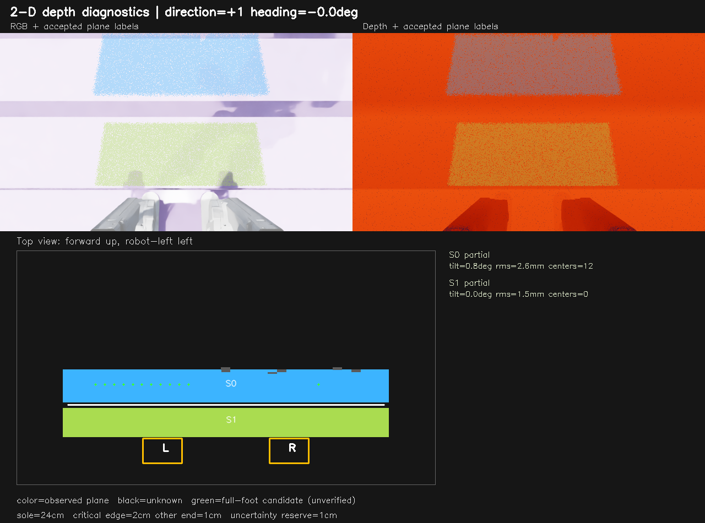
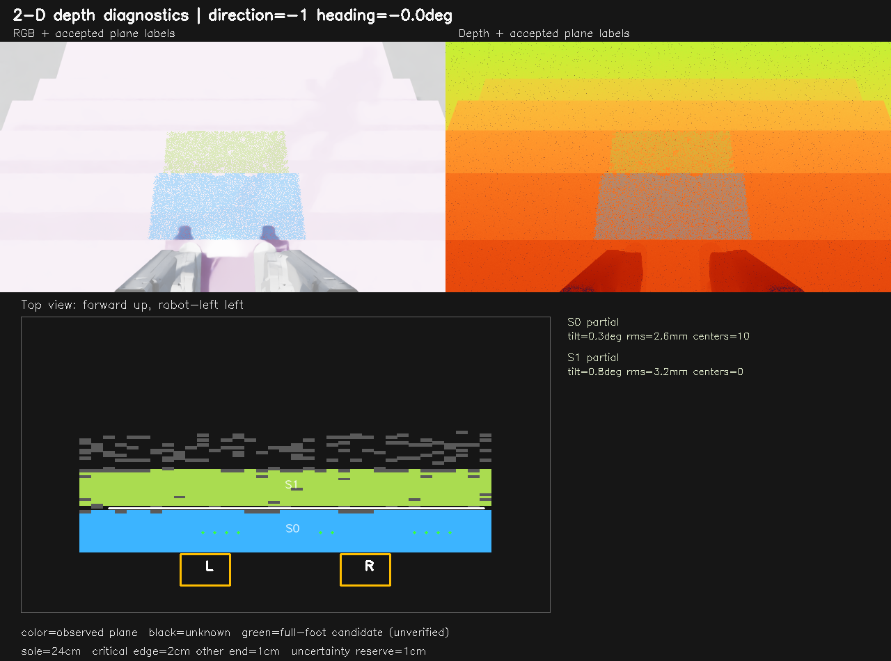
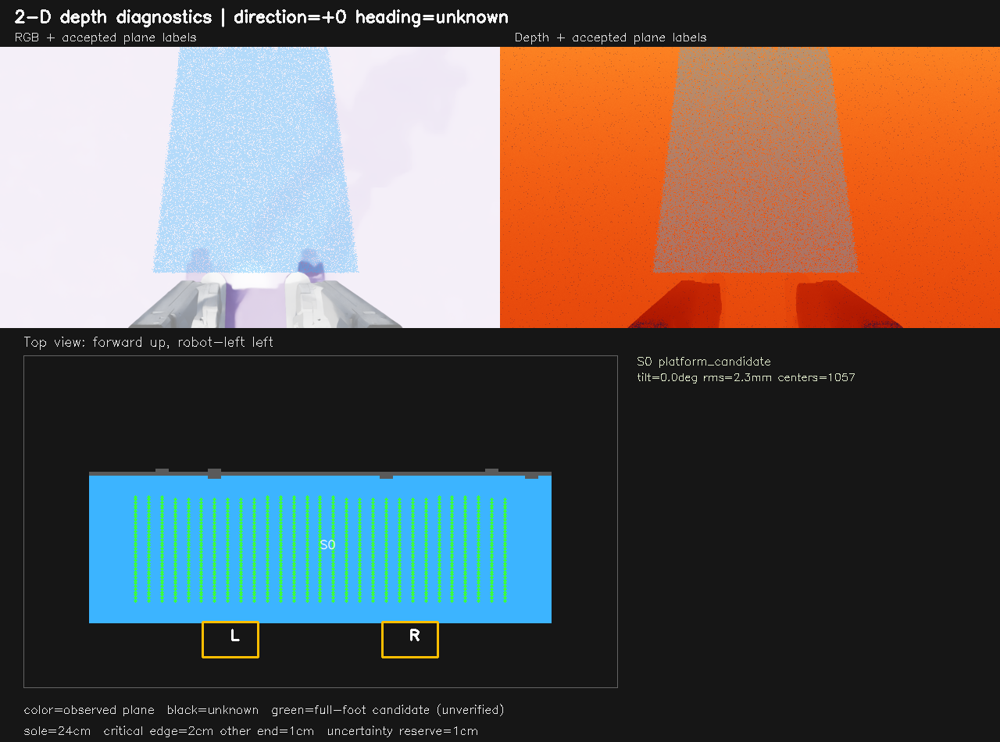
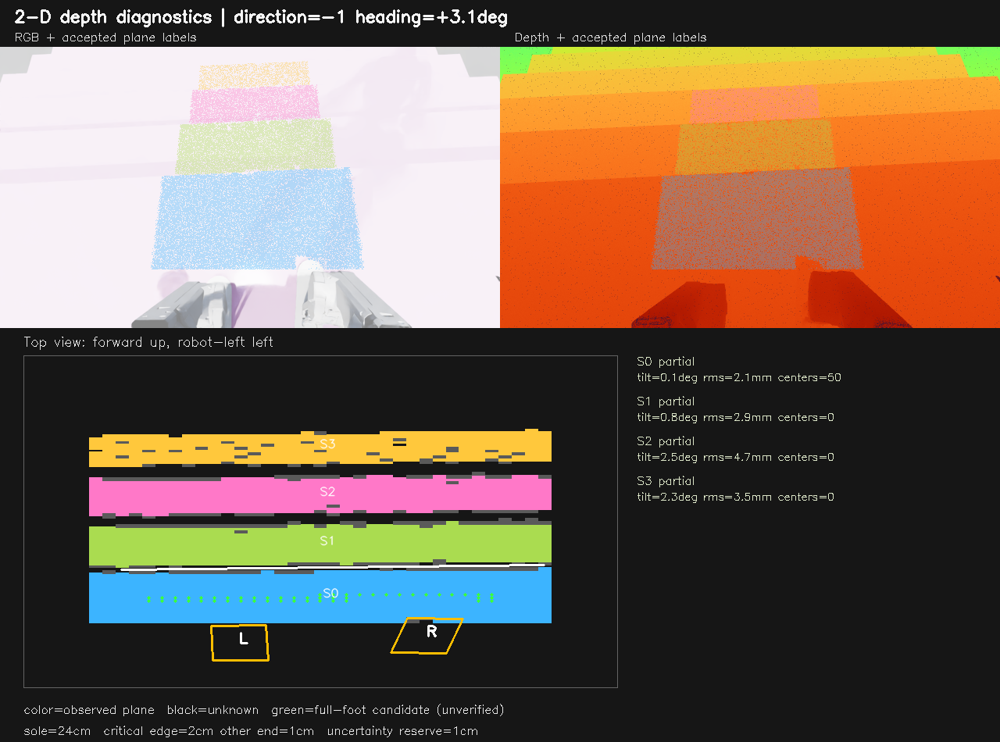

# 第一批：32 cm 楼梯二维感知检查

日期：2026-10-02。**二维诊断实现已完成并采集仿真图，但安全验收未通过；没有启动新策略训练。** 新二维输出未接入 Actor 或逐级阶段控制，旧策略输入、奖励和检查点保持不变。

## 实现内容

- 深度图在策略外投影到重力对齐的机身偏航坐标系；平面法向、拟合残差、二维实际观测覆盖、棱边与航向由独立诊断分支计算。
- 水平连通平面不再要求两条棱边才能成为平台候选；垂直面、倾斜超过 5 度或拟合残差超过 15 mm 的面不作为水平支撑面。
- 不填补未知栅格；保留遮挡、缺深度和左右覆盖差异。根据已观测区域计算完整脚掌中心候选，而不是只检查踝点。
- URDF 碰撞脚掌为 24 cm × 8.4 cm；上楼关键端是脚跟，距近棱边要求 2 cm；下楼关键端是脚尖，距前方落差棱边要求 2 cm。另一端留 1 cm，纵向两端各额外预留 1 cm 名义误差。横向也留净距及误差预留。
- 原始相机为 1280×720，新二维分支从原图独立采样到 640×360；旧 Actor 一维几何仍为 160×90。单元测试确认开启诊断不会改变旧 Actor 几何特征。

1 cm 名义误差预留不是已标定的真机误差上界。绿色点只表示根据当前估计计算出的候选，**不代表真实地形上的 2 cm 净距已得到保证**。诊断默认关闭，不能将 CPU 单环境实现直接用于 512 环境训练。

## 实际相机检查

使用 Isaac Sim RTX 仿真 D435i，不是真机录像。踏面固定 32 cm、8 级上下楼；检查 11、15、16 cm 高度。每个高度有上下楼各三处位置、三种姿态：接近楼梯、中段、末端平台；姿态为正向、偏航 8 度、俯仰 8 度。15 cm 另使用原盲走权重采集每方向 160 个控制步中的 8 帧。它只是动态深度检查，不是上下楼技能验收。

| 高度 | 采样帧 | 已接受平面 | 末端平台检出 | 候选净距真值违规数 | 最大棱边绝对误差 |
| --- | ---: | ---: | ---: | ---: | ---: |
| 11 cm | 18 | 39 | 6/6 | 1 | 32.5 mm |
| 15 cm | 34 | 82 | 6/6 | 15 | 31.8 mm |
| 16 cm | 18 | 32 | 6/6 | 2 | 29.8 mm |

棱边误差只统计成功拟合的边，不包含漏检，不能解释为整体误差上界。候选违规数统计的是候选栅格，不是机器人实际落脚次数；用实际生成的楼梯上表面独立核验纵向完整脚掌与关键净距，仿真真值不参与提取或 Actor 输入。

主要剩余问题：

1. 上楼接近位置的三种姿态均未给出完整脚掌候选；15 cm 动态上楼 8 帧仅 1 帧有候选。观测覆盖及可用时长不足，不能只凭平面识别成功就开始迈脚。
2. 下楼接近时可识别上方平台，但因相邻踏面之间的遮挡，二维航向和方向尚不能确认；不能把有平台候选误当成已确认下楼模式。
3. 下楼拟合棱边仍有约 1.4–3.2 cm 偏差，1 cm 名义误差预留不足以直接保证要求。新的二维分支没有套用旧一维 -6.5 cm 补偿。
4. 15 cm 上楼中段正向图的 12 个候选全部未满足真值净距；仅看绿色点就选落脚目标是不安全的。需要完善观测边界、栅格不确定度和候选过滤。
5. 新二维跨帧地图、固定台阶 ID、世界目标锁定、双脚同级阶段及承重闭环尚未完成。现在不能称为已经学会踩准或站稳。

## 图像

左上 RGB，右上深度；下方为俯视二维已观测区域。颜色表示平面，黑色表示未知，绿色表示未通过独立安全验收的脚掌中心候选；橙色 L/R 脚掌轮廓来自机器人足部姿态，不是从 RGB 检测出来的。脚掌位于未知区也不说明它悬空，只说明当前相机没有观测到其下方区域。

上楼中段：能验证水平面，但此图的候选净距核验失败。



下楼中段：区分已观测踏面与遮挡区域；绿色候选不能代替接触承重确认。



末端平台：不需要双棱边配对即可检出水平区域。



动态盲走采样：有候选不等于已采用它控制落脚。



## 落脚反馈方式

深度负责测地形；关节编码器、机器人运动学和机身状态估计负责定位双脚。相机外参和时间同步将两者放入共同坐标系。落脚验证还需高度贴合、向上接触及承重、低滑移与稳定确认窗口，不依赖 RGB 看见双脚。仿真读取足部姿态和物理接触作检查；实机使用自身传感器或经标定的接触估计。

双脚同级站立阶段才要求两只脚都满足指定台阶的左右目标；抬脚阶段主要保持支撑脚有效，不能要求摆动脚也在支撑平面上。新阶段控制仍待实现，细节见 [逐级控制方案](stair_step_control_plan.md)。

## 复现与文件

```bash
/home/hamlet/miniconda3/envs/isaac_sim_env/bin/python -u legged_lab/scripts/inspect_stair_surfaces.py \
  --headless --heights 0.15 --walking_steps 160 \
  --output_dir logs/stair_surfaces_32cm/recheck_15cm
```

每次传一个高度。`--walking_steps=0` 仅采受控姿态图，不需加载策略权重。RGB 只供查看，未进入策略。

本机原始深度、RGB、内参、相机/机身/双脚姿态及审计真值均在对应 `raw/*.npz`；逐面数据在 `surfaces.csv`，完整报告在 `report.json`：

- `logs/stair_surfaces_32cm/11cm/`
- `logs/stair_surfaces_32cm/15cm_audited/`
- `logs/stair_surfaces_32cm/16cm/`

单元测试 46 项通过；这证明覆盖的算法行为和旧输入兼容性，不证明楼梯技能安全。下一批先修候选安全与跨帧可用性，再做单台阶动作和双脚承重闭环。
